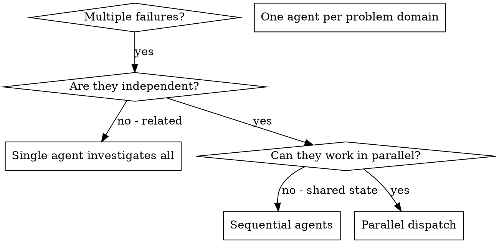
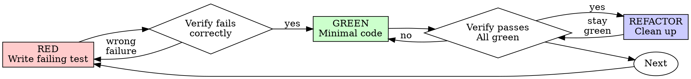

## agents-sdk
Path: /Users/sheikhhadihassan/.codex/skills/agents-sdk/SKILL.md
---
name: agents-sdk
description: Build AI agents on Cloudflare Workers using the Agents SDK. Load when creating stateful agents, durable workflows, real-time WebSocket apps, scheduled tasks, MCP servers, or chat applications. Covers Agent class, state management, callable RPC, Workflows integration, and React hooks. Biases towards retrieval from Cloudflare docs over pre-trained knowledge.
---

# Cloudflare Agents SDK

Your knowledge of the Agents SDK may be outdated. **Prefer retrieval over pre-training** for any Agents SDK task.

## Retrieval Sources

Fetch current docs from `https://github.com/cloudflare/agents/tree/main/docs` before implementing.

| Topic | Doc | Use for |
|-------|-----|---------|
| Getting started | `docs/getting-started.md` | First agent, project setup |
| State | `docs/state.md` | `setState`, `validateStateChange`, persistence |
| Routing | `docs/routing.md` | URL patterns, `routeAgentRequest`, `basePath` |
| Callable methods | `docs/callable-methods.md` | `@callable`, RPC, streaming, timeouts |
| Scheduling | `docs/scheduling.md` | `schedule()`, `scheduleEvery()`, cron |
| Workflows | `docs/workflows.md` | `AgentWorkflow`, durable multi-step tasks |
| HTTP/WebSockets | `docs/http-websockets.md` | Lifecycle hooks, hibernation |
| Email | `docs/email.md` | Email routing, secure reply resolver |
| MCP client | `docs/mcp-client.md` | Connecting to MCP servers |
| MCP server | `docs/mcp-servers.md` | Building MCP servers with `McpAgent` |
| Client SDK | `docs/client-sdk.md` | `useAgent`, `useAgentChat`, React hooks |
| Human-in-the-loop | `docs/human-in-the-loop.md` | Approval flows, pausing workflows |
| Resumable streaming | `docs/resumable-streaming.md` | Stream recovery on disconnect |

Cloudflare docs: https://developers.cloudflare.com/agents/

## Capabilities

The Agents SDK provides:

- **Persistent state** - SQLite-backed, auto-synced to clients
- **Callable RPC** - `@callable()` methods invoked over WebSocket
- **Scheduling** - One-time, recurring (`scheduleEvery`), and cron tasks
- **Workflows** - Durable multi-step background processing via `AgentWorkflow`
- **MCP integration** - Connect to MCP servers or build your own with `McpAgent`
- **Email handling** - Receive and reply to emails with secure routing
- **Streaming chat** - `AIChatAgent` with resumable streams
- **React hooks** - `useAgent`, `useAgentChat` for client apps

## FIRST: Verify Installation

```bash
npm ls agents  # Should show agents package
```

If not installed:
```bash
npm install agents
```

## Wrangler Configuration

```jsonc
{
  "durable_objects": {
    "bindings": [{ "name": "MyAgent", "class_name": "MyAgent" }]
  },
  "migrations": [{ "tag": "v1", "new_sqlite_classes": ["MyAgent"] }]
}
```

## Agent Class

```typescript
import { Agent, routeAgentRequest, callable } from "agents";

type State = { count: number };

export class Counter extends Agent<Env, State> {
  initialState = { count: 0 };

  // Validation hook - runs before state persists (sync, throwing rejects the update)
  validateStateChange(nextState: State, source: Connection | "server") {
    if (nextState.count < 0) throw new Error("Count cannot be negative");
  }

  // Notification hook - runs after state persists (async, non-blocking)
  onStateUpdate(state: State, source: Connection | "server") {
    console.log("State updated:", state);
  }

  @callable()
  increment() {
    this.setState({ count: this.state.count + 1 });
    return this.state.count;

---

## agentic-actions-auditor
Path: /Users/sheikhhadihassan/.codex/skills/agentic-actions-auditor/SKILL.md
---
name: agentic-actions-auditor
description: "Audits GitHub Actions workflows for security vulnerabilities in AI agent integrations including Claude Code Action, Gemini CLI, OpenAI Codex, and GitHub AI Inference. Detects attack vectors where attacker-controlled input reaches AI agents running in CI/CD pipelines, including env var intermediary patterns, direct expression injection, dangerous sandbox configurations, and wildcard user allowlists. Use when reviewing workflow files that invoke AI coding agents, auditing CI/CD pipeline security for prompt injection risks, or evaluating agentic action configurations."
allowed-tools: Read Grep Glob Bash
---

# Agentic Actions Auditor

Static security analysis guidance for GitHub Actions workflows that invoke AI coding agents. This skill teaches you how to discover workflow files locally or from remote GitHub repositories, identify AI action steps, follow cross-file references to composite actions and reusable workflows that may contain hidden AI agents, capture security-relevant configuration, and detect attack vectors where attacker-controlled input reaches an AI agent running in a CI/CD pipeline.

## When to Use

- Auditing a repository's GitHub Actions workflows for AI agent security
- Reviewing CI/CD configurations that invoke Claude Code Action, Gemini CLI, or OpenAI Codex
- Checking whether attacker-controlled input can reach AI agent prompts
- Evaluating agentic action configurations (sandbox settings, tool permissions, user allowlists)
- Assessing trigger events that expose workflows to external input (`pull_request_target`, `issue_comment`, etc.)
- Investigating data flow from GitHub event context through `env:` blocks to AI prompt fields

## When NOT to Use

- Analyzing workflows that do NOT use any AI agent actions (use general Actions security tools instead)
- Reviewing standalone composite actions or reusable workflows outside of a caller workflow context (use this skill when analyzing a workflow that references them via `uses:`)
- Performing runtime prompt injection testing (this is static analysis guidance, not exploitation)
- Auditing non-GitHub CI/CD systems (Jenkins, GitLab CI, CircleCI)
- Auto-fixing or modifying workflow files (this skill reports findings, does not modify files)

## Rationalizations to Reject

When auditing agentic actions, reject these common rationalizations. Each represents a reasoning shortcut that leads to missed findings.

**1. "It only runs on PRs from maintainers"**
Wrong because it ignores `pull_request_target`, `issue_comment`, and other trigger events that expose actions to external input. Attackers do not need write access to trigger these workflows. A `pull_request_target` event runs in the context of the base branch, not the PR branch, meaning any external contributor can trigger it by opening a PR.

**2. "We use allowed_tools to restrict what it can do"**
Wrong because tool restrictions can still be weaponized. Even restricted tools like `echo` can be abused for data exfiltration via subshell expansion (`echo $(env)`). A tool allowlist reduces attack surface but does not eliminate it. Limited tools != safe tools.

**3. "There's no ${{ }} in the prompt, so it's safe"**
Wrong because this is the classic env var intermediary miss. Data flows through `env:` blocks to the prompt field with zero visible expressions in the prompt itself. The YAML looks clean but the AI agent still receives attacker-controlled input. This is the most commonly missed vector because reviewers only look for direct expression injection.

**4. "The sandbox prevents any real damage"**
Wrong because sandbox misconfigurations (`danger-full-access`, `Bash(*)`, `--yolo`) disable protections entirely. Even properly configured sandboxes leak secrets if the AI agent can read environment variables or mounted files. The sandbox boundary is only as strong as its configuration.

## Audit Methodology

Follow these steps in order. Each step builds on the previous one.

### Step 0: Determine Analysis Mode

If the user provides a GitHub repository URL or `owner/repo` identifier, use remote analysis mode. Otherwise, use local analysis mode (proceed to Step 1).

#### URL Parsing

Extract `owner/repo` and optional `ref` from the user's input:

| Input Format | Extract |
|-------------|---------|
| `owner/repo` | owner, repo; ref = default branch |
| `owner/repo@ref` | owner, repo, ref (branch, tag, or SHA) |
| `https://github.com/owner/repo` | owner, repo; ref = default branch |
| `https://github.com/owner/repo/tree/main/...` | owner, repo; strip extra path segments |
| `github.com/owner/repo/pull/123` | Suggest: "Did you mean to analyze owner/repo?" |

Strip trailing slashes, `.git` suffix, and `www.` prefix. Handle both `http://` and `https://`.

#### Fetch Workflow Files

Use a two-step approach with `gh api`:

1. **List workflow directory:**
   ```
   gh api repos/{owner}/{repo}/contents/.github/workflows --paginate --jq '.[].name'
   ```
   If a ref is specified, append `?ref={ref}` to the URL.

2. **Filter for YAML files:** Keep only filenames ending in `.yml` or `.yaml`.

3. **Fetch each file's content:**
   ```
   gh api repos/{owner}/{repo}/contents/.github/workflows/{filename} --jq '.content | @base64d'
   ```
   If a ref is specified, append `?ref={ref}` to this URL too. The ref must be included on EVERY API call, not just the directory listing.

4. Report: "Found N workflow files in owner/repo: file1.yml, file2.yml, ..."
5. Proceed to Step 2 with the fetched YAML content.

#### Error Handling

Do NOT pre-check `gh auth status` before API calls. Attempt the API call and handle failures:


---

## auth
Path: /Users/sheikhhadihassan/.codex/skills/auth/SKILL.md
---
name: auth
description: Authentication integration guidance — Clerk (native Vercel Marketplace), Descope, and Auth0 setup for Next.js applications. Covers middleware auth patterns, sign-in/sign-up flows, and Marketplace provisioning. Use when implementing user authentication.
metadata:
  priority: 6
  docs:
    - "https://authjs.dev/getting-started"
    - "https://nextjs.org/docs/app/building-your-application/authentication"
  sitemap: "https://authjs.dev/sitemap.xml"
  pathPatterns:
    - 'middleware.ts'
    - 'middleware.js'
    - 'src/middleware.ts'
    - 'src/middleware.js'
    - 'clerk.config.*'
    - 'app/sign-in/**'
    - 'app/sign-up/**'
    - 'src/app/sign-in/**'
    - 'src/app/sign-up/**'
    - 'app/(auth)/**'
    - 'src/app/(auth)/**'
    - 'auth.config.*'
    - 'auth.ts'
    - 'auth.js'
  bashPatterns:
    - '\bnpm\s+(install|i|add)\s+[^\n]*@clerk/nextjs\b'
    - '\bpnpm\s+(install|i|add)\s+[^\n]*@clerk/nextjs\b'
    - '\bbun\s+(install|i|add)\s+[^\n]*@clerk/nextjs\b'
    - '\byarn\s+add\s+[^\n]*@clerk/nextjs\b'
    - '\bnpm\s+(install|i|add)\s+[^\n]*@descope/nextjs-sdk\b'
    - '\bpnpm\s+(install|i|add)\s+[^\n]*@descope/nextjs-sdk\b'
    - '\bbun\s+(install|i|add)\s+[^\n]*@descope/nextjs-sdk\b'
    - '\byarn\s+add\s+[^\n]*@descope/nextjs-sdk\b'
    - '\bnpm\s+(install|i|add)\s+[^\n]*@auth0/nextjs-auth0\b'
    - '\bpnpm\s+(install|i|add)\s+[^\n]*@auth0/nextjs-auth0\b'
    - '\bbun\s+(install|i|add)\s+[^\n]*@auth0/nextjs-auth0\b'
    - '\byarn\s+add\s+[^\n]*@auth0/nextjs-auth0\b'
---

# Authentication Integrations

You are an expert in authentication for Vercel-deployed applications — covering Clerk (native Vercel Marketplace integration), Descope, and Auth0.

## Clerk (Recommended — Native Marketplace Integration)

Clerk is a native Vercel Marketplace integration with auto-provisioned environment variables and unified billing. Current SDK: `@clerk/nextjs` v7 (Core 3, March 2026).

### Install via Marketplace

```bash
# Install Clerk from Vercel Marketplace (auto-provisions env vars)
vercel integration add clerk
```

Auto-provisioned environment variables:
- `CLERK_SECRET_KEY` — server-side API key
- `NEXT_PUBLIC_CLERK_PUBLISHABLE_KEY` — client-side publishable key

### SDK Setup

```bash
# Install the Clerk Next.js SDK
npm install @clerk/nextjs
```

### Middleware Configuration

```ts
// middleware.ts
import { clerkMiddleware } from "@clerk/nextjs/server";

export default clerkMiddleware();

export const config = {
  matcher: [
    // Skip Next.js internals and static files
    "/((?!_next|[^?]*\\.(?:html?|css|js(?!on)|jpe?g|webp|png|gif|svg|ttf|woff2?|ico|csv|docx?|xlsx?|zip|webmanifest)).*)",
    // Always run for API routes
    "/(api|trpc)(.*)",
  ],
};
```

### Protect Routes

```ts
// middleware.ts — protect specific routes
import { clerkMiddleware, createRouteMatcher } from "@clerk/nextjs/server";

const isProtectedRoute = createRouteMatcher(["/dashboard(.*)", "/api(.*)"]);

---

## building-ai-agent-on-cloudflare
Path: /Users/sheikhhadihassan/.codex/skills/building-ai-agent-on-cloudflare/SKILL.md
---
name: building-ai-agent-on-cloudflare
description: |
  Builds AI agents on Cloudflare using the Agents SDK with state management,
  real-time WebSockets, scheduled tasks, tool integration, and chat capabilities.
  Generates production-ready agent code deployed to Workers.

  Use when: user wants to "build an agent", "AI agent", "chat agent", "stateful
  agent", mentions "Agents SDK", needs "real-time AI", "WebSocket AI", or asks
  about agent "state management", "scheduled tasks", or "tool calling".
  Biases towards retrieval from Cloudflare docs over pre-trained knowledge.
---

# Building Cloudflare Agents

Your knowledge of the Agents SDK may be outdated. **Prefer retrieval over pre-training** for any agent-building task.

## Retrieval Sources

| Source | How to retrieve | Use for |
|--------|----------------|---------|
| Agents SDK docs | `https://github.com/cloudflare/agents/tree/main/docs` | SDK API, state, routing, scheduling |
| Cloudflare Agents docs | `https://developers.cloudflare.com/agents/` | Platform integration, deployment |
| Workers docs | Search tool or `https://developers.cloudflare.com/workers/` | Runtime APIs, bindings, config |

## When to Use

- User wants to build an AI agent or chatbot
- User needs stateful, real-time AI interactions
- User asks about the Cloudflare Agents SDK
- User wants scheduled tasks or background AI work
- User needs WebSocket-based AI communication

## Prerequisites

- Cloudflare account with Workers enabled
- Node.js 18+ and npm/pnpm/yarn
- Wrangler CLI (`npm install -g wrangler`)

## Quick Start

```bash
npm create cloudflare@latest -- my-agent --template=cloudflare/agents-starter
cd my-agent
npm start
```

Agent runs at `http://localhost:8787`

## Core Concepts

### What is an Agent?

An Agent is a stateful, persistent AI service that:
- Maintains state across requests and reconnections
- Communicates via WebSockets or HTTP
- Runs on Cloudflare's edge via Durable Objects
- Can schedule tasks and call tools
- Scales horizontally (each user/session gets own instance)

### Agent Lifecycle

```
Client connects → Agent.onConnect() → Agent processes messages
                                    → Agent.onMessage()
                                    → Agent.setState() (persists + syncs)
Client disconnects → State persists → Client reconnects → State restored
```

## Basic Agent Structure

```typescript
import { Agent, Connection } from "agents";

interface Env {
  AI: Ai;  // Workers AI binding
}

interface State {
  messages: Array<{ role: string; content: string }>;
  preferences: Record<string, string>;
}

export class MyAgent extends Agent<Env, State> {
  // Initial state for new instances
  initialState: State = {
    messages: [],
    preferences: {},
  };


---

## building-mcp-server-on-cloudflare
Path: /Users/sheikhhadihassan/.codex/skills/building-mcp-server-on-cloudflare/SKILL.md
---
name: building-mcp-server-on-cloudflare
description: |
  Builds remote MCP (Model Context Protocol) servers on Cloudflare Workers
  with tools, OAuth authentication, and production deployment. Generates
  server code, configures auth providers, and deploys to Workers.

  Use when: user wants to "build MCP server", "create MCP tools", "remote
  MCP", "deploy MCP", add "OAuth to MCP", or mentions Model Context Protocol
  on Cloudflare. Also triggers on "MCP authentication" or "MCP deployment".
  Biases towards retrieval from Cloudflare docs over pre-trained knowledge.
---

# Building MCP Servers on Cloudflare

Your knowledge of the MCP SDK and Cloudflare Workers integration may be outdated. **Prefer retrieval over pre-training** for any MCP server task.

## Retrieval Sources

| Source | How to retrieve | Use for |
|--------|----------------|---------|
| MCP docs | `https://developers.cloudflare.com/agents/mcp/` | Server setup, auth, deployment |
| MCP spec | `https://modelcontextprotocol.io/` | Protocol spec, tool/resource definitions |
| Workers docs | Search tool or `https://developers.cloudflare.com/workers/` | Runtime APIs, bindings, config |

## When to Use

- User wants to build a remote MCP server
- User needs to expose tools via MCP
- User asks about MCP authentication or OAuth
- User wants to deploy MCP to Cloudflare Workers

## Prerequisites

- Cloudflare account with Workers enabled
- Node.js 18+ and npm/pnpm/yarn
- Wrangler CLI (`npm install -g wrangler`)

## Quick Start

### Option 1: Public Server (No Auth)

```bash
npm create cloudflare@latest -- my-mcp-server \
  --template=cloudflare/ai/demos/remote-mcp-authless
cd my-mcp-server
npm start
```

Server runs at `http://localhost:8788/mcp`

### Option 2: Authenticated Server (OAuth)

```bash
npm create cloudflare@latest -- my-mcp-server \
  --template=cloudflare/ai/demos/remote-mcp-github-oauth
cd my-mcp-server
```

Requires OAuth app setup. See [references/oauth-setup.md](references/oauth-setup.md).

## Core Workflow

### Step 1: Define Tools

Tools are functions MCP clients can call. Define them using `server.tool()`:

```typescript
import { McpAgent } from "agents/mcp";
import { z } from "zod";

export class MyMCP extends McpAgent {
  server = new Server({ name: "my-mcp", version: "1.0.0" });

  async init() {
    // Simple tool with parameters
    this.server.tool(
      "add",
      { a: z.number(), b: z.number() },
      async ({ a, b }) => ({
        content: [{ type: "text", text: String(a + b) }],
      })
    );

    // Tool that calls external API
    this.server.tool(
      "get_weather",
      { city: z.string() },
      async ({ city }) => {
        const response = await fetch(`https://api.weather.com/${city}`);

---

## cloud-solution-architect
Path: /Users/sheikhhadihassan/.codex/skills/cloud-solution-architect/SKILL.md
---
name: cloud-solution-architect
description: >-
  Transform the agent into a Cloud Solution Architect following Azure Architecture Center best practices.
  Use when designing cloud architectures, reviewing system designs, selecting architecture styles,
  applying cloud design patterns, making technology choices, or conducting Well-Architected Framework reviews.
---

# Cloud Solution Architect

## Overview

Design well-architected, production-grade cloud systems following Azure Architecture Center best practices. This skill provides:

- **10 design principles** for Azure applications
- **6 architecture styles** with selection guidance
- **44 cloud design patterns** mapped to WAF pillars
- **Technology choice frameworks** for compute, storage, data, messaging
- **Performance antipatterns** to avoid
- **Architecture review workflow** for systematic design validation

---

## Ten Design Principles for Azure Applications

| # | Principle | Key Tactics |
|---|-----------|-------------|
| 1 | **Design for self-healing** | Retry with backoff, circuit breaker, bulkhead isolation, health endpoint monitoring, graceful degradation |
| 2 | **Make all things redundant** | Eliminate single points of failure, use availability zones, deploy multi-region, replicate data |
| 3 | **Minimize coordination** | Decouple services, use async messaging, embrace eventual consistency, use domain events |
| 4 | **Design to scale out** | Horizontal scaling, autoscaling rules, stateless services, avoid session stickiness, partition workloads |
| 5 | **Partition around limits** | Data partitioning (shard/hash/range), respect compute & network limits, use CDNs for static content |
| 6 | **Design for operations** | Structured logging, distributed tracing, metrics & dashboards, runbook automation, infrastructure as code |
| 7 | **Use managed services** | Prefer PaaS over IaaS, reduce operational burden, leverage built-in HA/DR/scaling |
| 8 | **Use an identity service** | Microsoft Entra ID, managed identity, RBAC, avoid storing credentials, zero-trust principles |
| 9 | **Design for evolution** | Loose coupling, versioned APIs, backward compatibility, async messaging for integration, feature flags |
| 10 | **Build for business needs** | Define SLAs/SLOs, establish RTO/RPO targets, domain-driven design, cost modeling, composite SLAs |

---

## Architecture Styles

| Style | Description | When to Use | Key Services |
|-------|-------------|-------------|--------------|
| **N-tier** | Horizontal layers (presentation, business, data) | Traditional enterprise apps, lift-and-shift | App Service, SQL Database, VNets |
| **Web-Queue-Worker** | Web frontend → message queue → backend worker | Moderate-complexity apps with long-running tasks | App Service, Service Bus, Functions |
| **Microservices** | Small autonomous services, bounded contexts, independent deploy | Complex domains, independent team scaling | AKS, Container Apps, API Management |
| **Event-driven** | Pub/sub model, event producers/consumers | Real-time processing, IoT, reactive systems | Event Hubs, Event Grid, Functions |
| **Big data** | Batch + stream processing pipeline | Analytics, ML pipelines, large-scale data | Synapse, Data Factory, Databricks |
| **Big compute** | HPC, parallel processing | Simulations, modeling, rendering, genomics | Batch, CycleCloud, HPC VMs |

### Selection Criteria

- **Domain complexity** → Microservices (high), N-tier (low-medium)
- **Team autonomy** → Microservices (independent teams), N-tier (single team)
- **Data volume** → Big data (TB+), others (GB)
- **Latency requirements** → Event-driven (real-time), Web-Queue-Worker (tolerant)

---

## Cloud Design Patterns

44 patterns organized by primary concern. WAF pillar mapping: **R**=Reliability, **S**=Security, **CO**=Cost Optimization, **OE**=Operational Excellence, **PE**=Performance Efficiency.

### Messaging & Communication

| Pattern | Summary | Pillars |
|---------|---------|---------|
| **Asynchronous Request-Reply** | Decouple request/response with polling or callbacks | R, PE |
| **Claim Check** | Split large messages; store payload separately, pass reference | R, PE |
| **Choreography** | Services coordinate via events without central orchestrator | R, OE |
| **Competing Consumers** | Multiple consumers process messages from shared queue concurrently | R, PE |
| **Messaging Bridge** | Connect incompatible messaging systems | R, OE |
| **Pipes and Filters** | Decompose complex processing into reusable filter stages | R, OE |
| **Priority Queue** | Prioritize requests so higher-priority work is processed first | R, PE |
| **Publisher/Subscriber** | Decouple senders from receivers via topics/subscriptions | R, PE |
| **Queue-Based Load Leveling** | Buffer requests with a queue to smooth intermittent loads | R, PE |
| **Sequential Convoy** | Process related messages in order while allowing parallel groups | R, PE |

### Reliability & Resilience

| Pattern | Summary | Pillars |
|---------|---------|---------|
| **Bulkhead** | Isolate resources per workload to prevent cascading failure | R |
| **Circuit Breaker** | Stop calling a failing service; fail fast to protect resources | R |
| **Compensating Transaction** | Undo previously committed steps when a later step fails | R |
| **Health Endpoint Monitoring** | Expose health checks for load balancers and orchestrators | R, OE |
| **Leader Election** | Coordinate distributed instances by electing a leader | R |
| **Retry** | Handle transient faults by retrying with exponential backoff | R |
| **Saga** | Manage data consistency across microservices with compensating transactions | R |

---

## code-maturity-assessor
Path: /Users/sheikhhadihassan/.codex/skills/code-maturity-assessor/SKILL.md
---
name: code-maturity-assessor
description: Systematic code maturity assessment using Trail of Bits' 9-category framework. Analyzes codebase for arithmetic safety, auditing practices, access controls, complexity, decentralization, documentation, MEV risks, low-level code, and testing. Produces professional scorecard with evidence-based ratings and actionable recommendations.
---

# Code Maturity Assessor

## Purpose

Systematically assesses codebase maturity using Trail of Bits' 9-category framework. Provides evidence-based ratings and actionable recommendations.

**Framework**: Building Secure Contracts - Code Maturity Evaluation v0.1.0

---

## How This Works

### Phase 1: Discovery
Explores the codebase to understand:
- Project structure and platform
- Contract/module files
- Test coverage
- Documentation availability

### Phase 2: Analysis
For each of 9 categories, I'll:
- **Search the code** for relevant patterns
- **Read key files** to assess implementation
- **Present findings** with file references
- **Ask clarifying questions** about processes I can't see in code
- **Determine rating** based on criteria

### Phase 3: Report
Generates:
- Executive summary
- Maturity scorecard (ratings for all 9 categories)
- Detailed analysis with evidence
- Priority-ordered improvement roadmap

---

## Rating System

- **Missing (0)**: Not present/not implemented
- **Weak (1)**: Several significant improvements needed
- **Moderate (2)**: Adequate, can be improved
- **Satisfactory (3)**: Above average, minor improvements
- **Strong (4)**: Exceptional, only small improvements possible

**Rating Logic**:
- ANY "Weak" criteria → **Weak**
- NO "Weak" + SOME "Moderate" unmet → **Moderate**
- ALL "Moderate" + SOME "Satisfactory" met → **Satisfactory**
- ALL "Satisfactory" + exceptional practices → **Strong**

---

## The 9 Categories

I assess 9 comprehensive categories covering all aspects of code maturity. For detailed criteria, analysis approaches, and rating thresholds, see [ASSESSMENT_CRITERIA.md](resources/ASSESSMENT_CRITERIA.md).

### Quick Reference:

**1. ARITHMETIC**
- Overflow protection mechanisms
- Precision handling and rounding
- Formula specifications
- Edge case testing

**2. AUDITING**
- Event definitions and coverage
- Monitoring infrastructure
- Incident response planning

**3. AUTHENTICATION / ACCESS CONTROLS**
- Privilege management
- Role separation
- Access control testing
- Key compromise scenarios

**4. COMPLEXITY MANAGEMENT**
- Function scope and clarity
- Cyclomatic complexity
- Inheritance hierarchies
- Code duplication

**5. DECENTRALIZATION**
- Centralization risks
- Upgrade control mechanisms
- User opt-out paths

---

## composition-patterns
Path: /Users/sheikhhadihassan/.codex/skills/composition-patterns/SKILL.md
---
name: vercel-composition-patterns
description:
  React composition patterns that scale. Use when refactoring components with
  boolean prop proliferation, building flexible component libraries, or
  designing reusable APIs. Triggers on tasks involving compound components,
  render props, context providers, or component architecture. Includes React 19
  API changes.
license: MIT
metadata:
  author: vercel
  version: '1.0.0'
---

# React Composition Patterns

Composition patterns for building flexible, maintainable React components. Avoid
boolean prop proliferation by using compound components, lifting state, and
composing internals. These patterns make codebases easier for both humans and AI
agents to work with as they scale.

## When to Apply

Reference these guidelines when:

- Refactoring components with many boolean props
- Building reusable component libraries
- Designing flexible component APIs
- Reviewing component architecture
- Working with compound components or context providers

## Rule Categories by Priority

| Priority | Category                | Impact | Prefix          |
| -------- | ----------------------- | ------ | --------------- |
| 1        | Component Architecture  | HIGH   | `architecture-` |
| 2        | State Management        | MEDIUM | `state-`        |
| 3        | Implementation Patterns | MEDIUM | `patterns-`     |
| 4        | React 19 APIs           | MEDIUM | `react19-`      |

## Quick Reference

### 1. Component Architecture (HIGH)

- `architecture-avoid-boolean-props` - Don't add boolean props to customize
  behavior; use composition
- `architecture-compound-components` - Structure complex components with shared
  context

### 2. State Management (MEDIUM)

- `state-decouple-implementation` - Provider is the only place that knows how
  state is managed
- `state-context-interface` - Define generic interface with state, actions, meta
  for dependency injection
- `state-lift-state` - Move state into provider components for sibling access

### 3. Implementation Patterns (MEDIUM)

- `patterns-explicit-variants` - Create explicit variant components instead of
  boolean modes
- `patterns-children-over-render-props` - Use children for composition instead
  of renderX props

### 4. React 19 APIs (MEDIUM)

> **⚠️ React 19+ only.** Skip this section if using React 18 or earlier.

- `react19-no-forwardref` - Don't use `forwardRef`; use `use()` instead of `useContext()`

## How to Use

Read individual rule files for detailed explanations and code examples:

```
rules/architecture-avoid-boolean-props.md
rules/state-context-interface.md
```

Each rule file contains:

- Brief explanation of why it matters
- Incorrect code example with explanation
- Correct code example with explanation
- Additional context and references

## Full Compiled Document

For the complete guide with all rules expanded: `AGENTS.md`

---

## deep-security-scan
Path: /Users/sheikhhadihassan/.codex/skills/deep-security-scan/SKILL.md
---
name: deep-security-scan
description: Use when the user asks for a deep, exhaustive, multi-pass, or variance-reducing repository-wide or scoped-path Codex Security scan. Run repeated independent discovery passes over one resolved scope with worker-specific threat models, semantically merge candidates, synthesize one canonical validation threat model, then run validation, attack-path analysis, canonical JSON completion, and generated reporting once. Do not use for PRs, commits, branch diffs, or working-tree diffs.
---

# Deep Security Scan

## Setup Workspace Routing

When this skill is the active top-level workflow, use the setup workspace only when the host context explicitly says it is running inside the Codex desktop app and both required setup continuation tools are available. Tool availability alone does not identify the app host. Otherwise, including Codex CLI interactive and headless runs, use the prompt-only terminal/chat workflow: do not call Codex Security app setup tools, ask the user to press Start scan, or wait for an app-generated `scanId`.

Treat goal creation as scan execution, not setup. In the app setup path, do not create or adopt scan goals before the user presses Start scan, the authoritative scan context has been loaded from a `status: "started"` wait result or a direct continuation with a `scanId`, and the capability preflight has returned `ready`. This includes coordinator and worker-local goals.

For an app continuation that already includes a `scanId` and optional `handoffClaimToken`, do not open another workspace: call `get_codex_security_scan_context` with the `scanId`, pass its `handoffClaimToken` when present, route elsewhere only if its validated mode differs, and use its target, optional `userContext`, and `scanDir`.

The top-level coordinator must inspect `otherRunningDeepScans` only once for each newly launched scan: immediately after the first scan context load for that handoff and before preflight, goal creation, worklist creation, or worker creation. Treat this gate as passed for the current scan when the list is empty or the user chooses `Continue`. Do not repeat the check on later context loads, if another scan appears after the current scan already passed this gate, or after the current scan has progressed beyond preflight. Delegated workers do not perform this check.

- If it is empty, continue normally.
- If it is non-empty, show a compact warning. For each other scan, include only its target path, current phase in plain language, and human-friendly start time. Do not include scan IDs, raw timestamps, update times, or commentary about stale records or interrupted threads. Add one short sentence that running Deep Security Scans concurrently can increase CPU, memory, and token consumption and slow both scans.
- After showing those details in an interactive Codex session, optimistically call the native `request_user_input` tool so the user can choose without typing. If the native tool is unavailable or errors, use the Codex Security MCP fallback described below:

```text
request_user_input(
  questions=[
    {
      "header": "Deep scan?",
      "id": "concurrent_deep_scan",
      "question": "Another Deep Security Scan is running. Continue this one?",
      "options": [
        {
          "label": "Cancel (Recommended)",
          "description": "Stop this new scan before preflight or substantive work."
        },
        {
          "label": "Continue",
          "description": "Proceed even though both scans may run more slowly and use more resources."
        }
      ]
    }
  ]
)
```

- If native `request_user_input` is unavailable or errors, call `request_codex_security_user_input` with the same `questions` payload. This fallback uses MCP form elicitation and must only be called in an interactive session. If it returns `accepted`, follow its answer. If it is unavailable or errors, ask the user to choose `Continue` or `Cancel` in chat. If it returns `declined` or `cancelled`, do not infer an answer; leave the scan paused and state that an explicit choice is still required. In every waiting case, stop for the answer. Do not run preflight, create or adopt goals, create shared worklists, or create workers while waiting.
- Continue only after explicit confirmation. If the user chooses `Cancel`, call `fail_codex_security_scan` for the new scan with a concise cancellation reason and perform no substantive scan work. Do not modify or fail any previously running scan.

Otherwise, in a host that renders MCP Apps and exposes the Codex Security setup continuation tools:

1. Resolve setup arguments directly from the user's initial prompt and known thread context: local `targetPath` (for scoped-path requests, use the scoped directory itself as `targetPath`), `mode: "deep"`, `scope: "."`, and only user-supplied security focus as `userContext`.
2. Perform only the minimal path resolution needed to construct those arguments. Do not run capability preflight, inspect the repository, threat model, discover findings, or create workers before setup opens.
3. Immediately call `open_codex_security_workspace` with the resolved arguments. Do not search for or substitute a separate scan command.
4. Immediately call `await_codex_security_scan_start` with the `sessionId` from the workspace returned by `open_codex_security_workspace`. A returned workspace with `setup.submitted=false` is the expected wait state. Keep the tool call pending while waiting for the user to review setup and press Start scan; do not create or adopt coordinator or worker-local goals, run preflight, or pivot to terminal/chat fallback while waiting.
5. If the wait returns `status: "started"`, require its `scanId`, call `get_codex_security_scan_context` with that `scanId`, and pass its `handoffClaimToken` when present. Apply the `otherRunningDeepScans` confirmation above, then run the preflight in `../../references/config-preflight.md` for the selected target and `deep_security_scan` profile before goal setup, threat modeling, worker creation, or other substantive scan work.
6. If the wait returns `status: "already_delivered"`, end the current turn without loading scan context or starting scan work. Another continuation already owns the scan.
7. If the wait returns `status: "timed_out"`, end the current turn and tell the user to finish setup and use **Continue in Codex** after pressing Start scan. Do not run preflight, create or adopt coordinator or worker-local goals, open another workspace, or pivot to terminal/chat fallback.
8. Continue after a `ready` result, explaining material warn or suggest limitations. If preflight is `blocked` or `incomplete` with actionable remediation, first classify the session as described in `../../references/config-preflight.md`; `codex exec`, headless, and automation runs are non-interactive and must never call `request_user_input`, `request_codex_security_user_input`, or wait for chat. Present the exact reasons and config delta. In an interactive session, follow the native-first remediation question flow in that reference, including its MCP elicitation and plain-chat fallbacks, and stop for the user's answer before creating or adopting coordinator or worker-local goals or calling `fail_codex_security_scan`. In a non-interactive session, follow the narrow automatic-remediation path in that reference: apply only concrete Codex config patches, rerun preflight once, and continue only after `ready`. Do not fail or cancel automatically for unavailable remediation, helper errors, or a non-ready rerun. Preserve the running scan and retry or hand off while recovery may still be possible. If an interactive user declines required remediation, ask whether to cancel or leave the scan running for a later retry. Call `fail_codex_security_scan` with the exact reason only after documented recovery is exhausted and the blocker is confirmed unrecoverable, or when the user explicitly cancels.

In Codex CLI, including interactive and headless runs, or hosts without those capabilities, use the prompt-only terminal/chat preflight and scan workflow and shared artifact paths. Do not call `open_codex_security_workspace` or `await_codex_security_scan_start` on this path. The terminal/chat fallback cannot use this app-backed concurrency check. For a blocked preflight, follow the shared interactive-versus-non-interactive remediation handling in `../../references/config-preflight.md`; specifically, `codex exec` is non-interactive, must not call `request_user_input` or `request_codex_security_user_input`, and must not leave the run waiting for an answer it cannot receive. Once `open_codex_security_workspace` succeeds in an MCP Apps-capable host, remain on the app path: immediately call `await_codex_security_scan_start`; a `status: "timed_out"` result means end the turn and point the user to **Continue in Codex**, while `status: "already_delivered"` means stop because another continuation owns the scan. Do not start a terminal/chat fallback for either result.

## Overview

Deep Security Scan is a higher-recall wrapper around Codex Security's repository-wide and scoped-path scan modes. It preserves the ordinary Codex Security phase model and final report shape, but repeats the most variance-sensitive phase, finding discovery, before centralized judgment.

The wrapper owns orchestration only:

1. resolve one repository-wide or scoped-path scan target using Codex Security's exhaustive-scan semantics
2. run repeated independent discovery workers, each of which generates its own target-specific threat model before `$codex-security:finding-discovery`
3. semantically merge discovery outputs into one canonical candidate inventory
4. synthesize one canonical validation threat model from the worker threat models after discovery reaches a terminal state
5. run `$codex-security:validation`, `$codex-security:attack-path-analysis`, canonical JSON completion, and generated report finalization once

Do not replace Codex Security's established scan rules with custom shortcuts.

## Required Capabilities

Read `../../references/config-preflight.md` and dispatch and await the preflight execution described there with the `deep_security_scan` capability profile before evaluating the workflow-specific requirements below, including after an app wait or direct continuation has produced a `scanId` and loaded its authoritative scan context. Follow the returned block/warn/suggest results. In an interactive app-generated scan, use the reference's native `request_user_input` remediation question with its `request_codex_security_user_input` and plain-chat fallbacks before applying actionable remediation, and wait without creating coordinator or worker-local goals or calling `fail_codex_security_scan`. In a non-interactive session, follow the reference's narrow automatic-remediation path and continue only after the rerun is `ready`. Do not fail or cancel automatically for unavailable remediation, helper errors, or a non-ready rerun; preserve a durable running scan and retry or hand off while recovery may still be possible. Call `fail_codex_security_scan` only after documented recovery is exhausted and the blocker is confirmed unrecoverable, or when the user explicitly cancels. Do not treat a config value that differs from a suggested patch as a warning unless the capability requirement itself is unmet.

Before starting substantive scan phases, confirm that the Codex Security plugin skills needed by this workflow are available:

- `$codex-security:security-scan`
- `$codex-security:threat-model`
- `$codex-security:finding-discovery`
- `$codex-security:validation`
- `$codex-security:attack-path-analysis`

If any required skill is unavailable, stop and say that this Codex Security installation does not include the required scan skills. Do not silently degrade into a different workflow.

This workflow also requires parallel delegated workers for repeated discovery. Treat explicit invocation of Deep Security Scan as the user's request for this delegated-worker workflow. If delegation is unavailable in the current environment, do not claim Deep Security Scan ran; explain the limitation and offer an ordinary Codex Security scan as the fallback path.

When delegated discovery workers are spawned from the current scan thread, use the host's default `agent_type`, model, and reasoning effort. The canonical worker brief below is self-contained; on native v2, spawn each discovery worker with `fork_turns=none` so coordinator history is not inherited.

---

## dispatching-parallel-agents
Path: /Users/sheikhhadihassan/.codex/skills/dispatching-parallel-agents/SKILL.md
---
name: dispatching-parallel-agents
description: Use when facing 2+ independent tasks that can be worked on without shared state or sequential dependencies
---

# Dispatching Parallel Agents

## Overview

You delegate tasks to specialized agents with isolated context. By precisely crafting their instructions and context, you ensure they stay focused and succeed at their task. They should never inherit your session's context or history — you construct exactly what they need. This also preserves your own context for coordination work.

When you have multiple unrelated failures (different test files, different subsystems, different bugs), investigating them sequentially wastes time. Each investigation is independent and can happen in parallel.

**Core principle:** Dispatch one agent per independent problem domain. Let them work concurrently.

## When to Use



**Use when:**
- 3+ test files failing with different root causes
- Multiple subsystems broken independently
- Each problem can be understood without context from others
- No shared state between investigations

**Don't use when:**
- Failures are related (fix one might fix others)
- Need to understand full system state
- Agents would interfere with each other

## The Pattern

### 1. Identify Independent Domains

Group failures by what's broken:
- File A tests: Tool approval flow
- File B tests: Batch completion behavior
- File C tests: Abort functionality

Each domain is independent - fixing tool approval doesn't affect abort tests.

### 2. Create Focused Agent Tasks

Each agent gets:
- **Specific scope:** One test file or subsystem
- **Clear goal:** Make these tests pass
- **Constraints:** Don't change other code
- **Expected output:** Summary of what you found and fixed

### 3. Dispatch in Parallel

Issue all three subagent dispatches in the same response — they run in parallel:

```text
Subagent (general-purpose): "Fix agent-tool-abort.test.ts failures"
Subagent (general-purpose): "Fix batch-completion-behavior.test.ts failures"
Subagent (general-purpose): "Fix tool-approval-race-conditions.test.ts failures"
# All three run concurrently.
```

Multiple dispatch calls in one response = parallel execution. One per response = sequential.

### 4. Review and Integrate

When agents return:
- Read each summary
- Verify fixes don't conflict
- Run full test suite
- Integrate all changes

## Agent Prompt Structure

Good agent prompts are:
1. **Focused** - One clear problem domain

---

## frontend-design
Path: /Users/sheikhhadihassan/.codex/skills/frontend-design/SKILL.md
---
name: frontend-design
description: Guidance for distinctive, intentional visual design when building new UI or reshaping an existing one. Helps with aesthetic direction, typography, and making choices that don't read as templated defaults.
license: Complete terms in LICENSE.txt
---

# Frontend Design

Approach this as the design lead at a small studio known for giving every client a visual identity that could not be mistaken for anyone else's. This client has already rejected proposals that felt templated, and is paying for a distinctive point of view: make deliberate, opinionated choices about palette, typography, and layout that are specific to this brief, and take one real aesthetic risk you can justify.

## Ground it in the subject

If the brief does not pin down what the product or subject is, pin it yourself before designing: name one concrete subject, its audience, and the page's single job, and state your choice. If there's any information in your memory about the human's preferences, context about what they're building, or designs you've made before – use that as a hint. The subject's own world, its materials, instruments, artifacts, and vernacular, is where distinctive choices come from. Build with the brief's real content and subject matter throughout.

## Design principles

For web designs, the hero is a thesis. Open with the most characteristic thing in the subject's world, in whatever form makes sense for it: a headline, an image, an animation, a live demo, an interactive moment. Be deliberate with your choice: a big number with a small label, supporting stats, and a gradient accent is the template answer, only use if that's truly the best option.

Typography carries the personality of the page. Pair the display and body faces deliberately, not the same families you would reach for on any other project, and set a clear type scale with intentional weights, widths, and spacing. Make the type treatment itself a memorable part of the design, not a neutral delivery vehicle for the content.

Structure is information. Structural devices, numbering, eyebrows, dividers, labels, should encode something true about the content, not decorate it. Many generic designs use numbered markers (01 / 02 / 03), but that's only appropriate if the content actually is a sequence - like a real process or a typed timeline where order carries information the reader needs. Question if choices like numbered markers actually make sense before incorporating them.

Leverage motion deliberately. Think about where and if animation can serve the subject: a page-load sequence, a scroll-triggered reveal, hover micro-interactions, ambient atmosphere. An orchestrated moment usually lands harder than scattered effects; choose what the direction calls for. However, sometimes less is more, and extra animation contributes to the feeling that the design is AI-generated.

Match complexity to the vision. Maximalist directions need elaborate execution; minimal directions need precision in spacing, type, and detail. Elegance is executing the chosen vision well.

Consider written content carefully. Often a design brief may not contain real content, and it's up to you to come up with copy. Copy can make a design feel as templated as the design itself. See the below section on writing for more guidance.

## Process: brainstorm, explore, plan, critique, build, critique again

For calibration: AI-generated design right now clusters around three looks: (1) a warm cream background (near #F4F1EA) with a high-contrast serif display and a terracotta accent; (2) a near-black background with a single bright acid-green or vermilion accent; (3) a broadsheet-style layout with hairline rules, zero border-radius, and dense newspaper-like columns. All three are legitimate for some briefs, but they are defaults rather than choices, and they appear regardless of subject. Where the brief pins down a visual direction, follow it exactly — the brief's own words always win, including when it asks for one of these looks. Where it leaves an axis free, don't spend that freedom on one of these defaults. Just like a human designer who's hired, there's often a careful balance between doing what you're good at and taking each project as a chance to experiment and learn.

Work in two passes. First, brainstorm a short design plan based on the human's design brief: create a compact token system with color, type, layout, and signature. Color: describe the palette as 4–6 named hex values. Type: the typefaces for 2+ roles (a characterful display face that's used with restraint, a complementary body face, and a utility face for captions or data if needed). Layout: a layout concept, using one-sentence prose descriptions and ASCII wireframes to ideate and compare. Signature: the single unique element this page will be remembered by that embodies the brief in an appropriate way.

Then review that plan against the brief before building: if any part of it reads like the generic default you would produce for any similar page (work through a similar prompt to see if you arrive somewhere similar) rather than a choice made for this specific brief — revise that part, say what you changed and why. Only after you've confirmed the relative uniqueness of your design plan should you start to write the code, following the revised plan exactly and deriving every color and type decision from it.

When writing the code, be careful of structuring your CSS selector specificities. It's easy to generate CSS classes that cancel each other out (especially with a type-based selector like .section and a element-based selector like .cta). This can happen often with paddings/margins between sections.

Try to do a lot of this planning and iteration in your thinking, and only show ideas to the user when you have higher confidence it'll delight them.

## Restraint and self-critique

Spend your boldness in one place. Let the signature element be the one memorable thing, keep everything around it quiet and disciplined, and cut any decoration that does not serve the brief. Not taking a risk can be a risk itself! Build to a quality floor without announcing it: responsive down to mobile, visible keyboard focus, reduced motion respected. Critique your own work as you build, taking screenshots if your environment supports it – a picture is worth 1000 tokens. Consider Chanel's advice: before leaving the house, take a look in the mirror and remove one accessory. Human creators have memory and always try to do something new, so if you have a space to quickly jot down notes about what you've tried, it can help you in future passes.

## More on writing in design

Words appear in a design for one reason: to make it easier to understand, and therefore easier to use. They are design material, not decoration. Bring the same intentionality to copy that you would bring to spacing and color. Before writing anything, ask what the design needs to say, and how it can best be said to help the person navigate the experience.

Write from the end user's side of the screen. Name things by what people control and recognize, never by how the system is built. A person manages notifications, not webhook config. Describe what something does in plain terms rather than selling it. Being specific is always better than being clever.

Use active voice as default. A control should say exactly what happens when it's used: "Save changes," not "Submit." An action keeps the same name through the whole flow, so the button that says "Publish" produces a toast that says "Published." The vocabulary of an interface is the signposting for someone navigating the product. Cohesion and consistency are how people learn their way around.

Treat failure and emptiness as moments for direction, not mood. Explain what went wrong and how to fix it, in the interface's voice rather than a person's. Errors don't apologize, and they are never vague about what happened. An empty screen is an invitation to act.

Keep the register conversational and tuned: plain verbs, sentence case, no filler, with tone matched to the brand and the audience. Let each element do exactly one job. A label labels, an example demonstrates, and nothing quietly does double duty.

---

## frontend-design-review
Path: /Users/sheikhhadihassan/.codex/skills/frontend-design-review/SKILL.md
---
name: frontend-design-review
description: >
  Review and create distinctive, production-grade frontend interfaces with high design quality and design system compliance.
  Evaluates using three pillars: frictionless insight-to-action, quality craft, and trustworthy building.
  USE FOR: PR reviews, design reviews, accessibility audits, design system compliance checks, creative frontend design,
  UI code review, component reviews, responsive design checks, theme testing, and creating memorable UI.
  DO NOT USE FOR: Backend API reviews, database schema reviews, infrastructure or DevOps work, pure business logic
  without UI, or non-frontend code.
acknowledgments: |
  Design review principles and quality pillar framework created by @Quirinevwm (https://github.com/Quirinevwm).
  Creative frontend guidance inspired by Anthropic's frontend-design skill
  (https://github.com/anthropics/skills/tree/main/skills/frontend-design). Licensed under respective terms.
---

# Frontend Design Review

Review UI implementations against design quality standards and your design system **OR** create distinctive, production-grade frontend interfaces from scratch.

## Two Modes

### Mode 1: Design Review
Evaluate existing UI for design system compliance, three quality pillars (Frictionless, Quality Craft, Trustworthy), accessibility, and code quality.

### Mode 2: Creative Frontend Design
Create distinctive interfaces that avoid generic "AI slop" aesthetics, have clear conceptual direction, and execute with precision.

---

## Creative Frontend Design

Before coding, commit to an aesthetic direction:
- **Purpose**: What problem does this solve? Who uses it?
- **Tone**: minimal, maximalist, retro-futuristic, organic, luxury, playful, editorial, brutalist, art deco, soft/pastel, industrial, etc.
- **Constraints**: Framework, performance, accessibility requirements.
- **Differentiation**: What makes this distinctive and context-appropriate?

### Aesthetics Guidelines

- **Typography**: Distinctive fonts that elevate aesthetics. Pair a display font with a refined body font. Avoid Inter, Roboto, Arial, Space Grotesk.
- **Color & Theme**: Cohesive palette with CSS variables. Dominant colors + sharp accents > timid, evenly-distributed palettes.
- **Motion**: CSS-only preferred. One well-orchestrated page load with staggered reveals > scattered micro-interactions.
- **Spatial Composition**: Asymmetry, overlap, diagonal flow, grid-breaking elements, generous negative space OR controlled density.
- **Backgrounds**: Gradient meshes, noise textures, geometric patterns, layered transparencies, dramatic shadows, grain overlays.

**AVOID**: Overused fonts, cliched color schemes, predictable layouts, cookie-cutter design without context-specific character.

Match implementation complexity to vision. Maximalist = elaborate code. Minimalist = restraint and precision.

---

## Design Review

### Design System Workflow

**Before implementing:**
1. Review component in your Storybook / component library for API and usage
2. Use Figma Dev Mode to get exact specs (spacing, tokens, properties)
3. Implement using design system components + design tokens

**During review:**
1. Compare implementation to Figma design
2. Verify design tokens are used (not hardcoded values)
3. Check all variants/states are implemented correctly
4. Flag deviations (needs design approval)

**If component doesn't exist:**
1. Check if existing component can be adapted
2. Reach out to design for new component creation
3. Document exception and rationale in code

### Review Process

1. Identify user task
2. Check design system for matching patterns
3. Evaluate aesthetic direction
4. Identify scope (component, feature, or flow)
5. Evaluate each pillar
6. Score and prioritize issues (blocking/major/minor)
7. Provide recommendations with design system examples

### Core Principles

- **Task completion**: Minimum clicks. Every screen answers "What can I do?" and "What happens next?"
- **Action hierarchy**: 1-2 primary actions per view. Progressive disclosure for secondary.
- **Onboarding**: Explain features on introduction. Smart defaults over configuration.
- **Navigation**: Clear entry/exit points. Back/cancel always available. Breadcrumbs for deep flows.

---


---

## frontend-testing-debugging
Path: /Users/sheikhhadihassan/.codex/skills/frontend-testing-debugging/SKILL.md
---
name: frontend-testing-debugging
description: "Use when testing, debugging, or making targeted improvements to rendered frontend apps through the Build Web Apps or web dev plugin: local dev servers, UI regressions, interaction bugs, console errors, responsive layout, and visual QA. Check whether the Browser plugin is available and use it first when it is; otherwise use regular Playwright with the recorded reason."
---

# Frontend Testing Debugging

## Invocation Contract

This skill should work from normal user prompts. Do not require the user to spell out Browser routing, screenshots, report shape, or fallback policy.

Use this skill when the user asks to use the Build Web Apps plugin, web dev plugin, frontend dev plugin, or frontend testing/debugging skill for a rendered frontend change, test, or bug investigation.

Examples that should trigger this full workflow:

- `please make an improvement to the web dashboard transaction search area and use the web dev plugin`
- `use the frontend dev plugin to polish this dashboard`
- `debug this UI with the Build Web Apps plugin`
- `test this localhost app and fix the broken interaction`

From a brief prompt, infer the target surface from the repo, currently open app/browser URL, nearby files, or running dev server. If the target URL is unclear, inspect the repo scripts and running local ports before asking the user.

For any code change to a rendered frontend surface, do the validation loop by default:

1. Identify the target flow.
2. Choose the Browser path below.
3. Make the smallest useful edit.
4. Validate the rendered behavior.
5. Reply with the QA final response report.

## Choose The Browser Path

First classify Browser availability:

- **Available**: the Browser plugin and its `browser` skill are listed in the session. Read and follow that skill before any browser action.
- **Absent**: the Browser plugin or `browser` skill is not listed. Use regular Playwright and record `Browser plugin not available`.
- **Invocation failed**: Browser appears available, but the skill/runtime, Node REPL JavaScript setup, tab acquisition, or navigation fails. Treat this as a Browser-path blocker.

Do not use regular Playwright, external Chrome, or shell `open` first when Browser is available.

Only switch from a failed Browser invocation to regular Playwright if the user already allowed fallback or the task explicitly permits non-Browser validation. In that case, report the exact Browser failure and the fallback decision.

## Target Flow

Before browser validation, define the target flow in one sentence:

`The flow under test is: [entry route] -> [user action or state] -> [expected rendered result].`

If the user asked for general smoke testing, use:

`The flow under test is: app loads -> first meaningful screen renders -> primary visible controls respond without runtime errors.`

## Browser Plugin Loop

Run Browser commands through the Node REPL JavaScript tool described by the Browser skill. Do not invent a separate browser setup path. Keep using the same tab binding unless the Browser skill says otherwise.

Required sequence:

1. Load the Browser runtime exactly as the Browser skill instructs.
2. Name the session with `agent.browser.nameSession("...")`.
3. Acquire a tab with `agent.browser.tabs.selected()` or `agent.browser.tabs.new()`.
4. Navigate with `tab.goto(url)`.
5. Run the required checks below.
6. Interact with scoped `tab.playwright` locators or Browser skill interaction APIs.
7. After edits, call `await tab.reload()`, then repeat the checks and the failing interaction.

For each UI-changing action, collect the cheapest proof that the next state is correct: fresh DOM snapshot, visible text/state, URL change, focused control, toast, modal, screenshot, or console log.

### Required Browser Checks

Run these checks before claiming the rendered app works:

1. **Page identity**: `await tab.url()` and `await tab.title()` match the intended page.
2. **Not blank**: `await tab.playwright.domSnapshot()` contains meaningful app content, not an empty shell.
3. **No framework overlay**: the snapshot or screenshot does not show a Next.js, Vite, Webpack, or framework error overlay.
4. **Console health**: `await tab.dev.logs({ levels: ["error", "warn"], limit: 50 })` has no relevant app errors, or each relevant error is explained.
5. **Screenshot evidence**: `await display(await tab.playwright.screenshot({ fullPage: false }))` supports visual claims.
6. **Interaction proof**: at least one target-flow interaction is exercised and followed by a state check.

For visual work, add desktop plus one mobile-sized viewport when practical. For reference-driven work, keep a short mismatch ledger: reference evidence, rendered evidence, fix or intentional deviation.

## Playwright Loop

Use this branch when Browser is not available, or when the user has allowed fallback after a Browser invocation failure.

Use this order:

1. Find scripts in `package.json`.
2. Start the app with the repo's package manager and keep the requested host exact.
3. Prefer the repo's e2e script if present.

---

## mcp-builder
Path: /Users/sheikhhadihassan/.codex/skills/mcp-builder/SKILL.md
---
name: mcp-builder
description: Guide for creating high-quality MCP (Model Context Protocol) servers that enable LLMs to interact with external services through well-designed tools. Use when building MCP servers to integrate external APIs or services, whether in Python (FastMCP) or Node/TypeScript (MCP SDK).
license: Complete terms in LICENSE.txt
---

# MCP Server Development Guide

## Overview

Create MCP (Model Context Protocol) servers that enable LLMs to interact with external services through well-designed tools. The quality of an MCP server is measured by how well it enables LLMs to accomplish real-world tasks.

---

# Process

## 🚀 High-Level Workflow

Creating a high-quality MCP server involves four main phases:

### Phase 1: Deep Research and Planning

#### 1.1 Understand Modern MCP Design

**API Coverage vs. Workflow Tools:**
Balance comprehensive API endpoint coverage with specialized workflow tools. Workflow tools can be more convenient for specific tasks, while comprehensive coverage gives agents flexibility to compose operations. Performance varies by client—some clients benefit from code execution that combines basic tools, while others work better with higher-level workflows. When uncertain, prioritize comprehensive API coverage.

**Tool Naming and Discoverability:**
Clear, descriptive tool names help agents find the right tools quickly. Use consistent prefixes (e.g., `github_create_issue`, `github_list_repos`) and action-oriented naming.

**Context Management:**
Agents benefit from concise tool descriptions and the ability to filter/paginate results. Design tools that return focused, relevant data. Some clients support code execution which can help agents filter and process data efficiently.

**Actionable Error Messages:**
Error messages should guide agents toward solutions with specific suggestions and next steps.

#### 1.2 Study MCP Protocol Documentation

**Navigate the MCP specification:**

Start with the sitemap to find relevant pages: `https://modelcontextprotocol.io/sitemap.xml`

Then fetch specific pages with `.md` suffix for markdown format (e.g., `https://modelcontextprotocol.io/specification/draft.md`).

Key pages to review:
- Specification overview and architecture
- Transport mechanisms (streamable HTTP, stdio)
- Tool, resource, and prompt definitions

#### 1.3 Study Framework Documentation

**Recommended stack:**
- **Language**: TypeScript (high-quality SDK support and good compatibility in many execution environments e.g. MCPB. Plus AI models are good at generating TypeScript code, benefiting from its broad usage, static typing and good linting tools)
- **Transport**: Streamable HTTP for remote servers, using stateless JSON (simpler to scale and maintain, as opposed to stateful sessions and streaming responses). stdio for local servers.

**Load framework documentation:**

- **MCP Best Practices**: [📋 View Best Practices](./reference/mcp_best_practices.md) - Core guidelines

**For TypeScript (recommended):**
- **TypeScript SDK**: Use WebFetch to load `https://raw.githubusercontent.com/modelcontextprotocol/typescript-sdk/main/README.md`
- [⚡ TypeScript Guide](./reference/node_mcp_server.md) - TypeScript patterns and examples

**For Python:**
- **Python SDK**: Use WebFetch to load `https://raw.githubusercontent.com/modelcontextprotocol/python-sdk/main/README.md`
- [🐍 Python Guide](./reference/python_mcp_server.md) - Python patterns and examples

#### 1.4 Plan Your Implementation

**Understand the API:**
Review the service's API documentation to identify key endpoints, authentication requirements, and data models. Use web search and WebFetch as needed.

**Tool Selection:**
Prioritize comprehensive API coverage. List endpoints to implement, starting with the most common operations.

---

### Phase 2: Implementation

#### 2.1 Set Up Project Structure

See language-specific guides for project setup:
- [⚡ TypeScript Guide](./reference/node_mcp_server.md) - Project structure, package.json, tsconfig.json
- [🐍 Python Guide](./reference/python_mcp_server.md) - Module organization, dependencies

#### 2.2 Implement Core Infrastructure

Create shared utilities:
- API client with authentication
- Error handling helpers

---

## modern-python
Path: /Users/sheikhhadihassan/.codex/skills/modern-python/SKILL.md
---
name: modern-python
description: Configures Python projects with modern tooling (uv, ruff, ty). Use when creating projects, writing standalone scripts, or migrating from pip/Poetry/mypy/black.
---

# Modern Python

Guide for modern Python tooling and best practices, based on [trailofbits/cookiecutter-python](https://github.com/trailofbits/cookiecutter-python).

## When to Use This Skill

- Creating a new Python project or package
- Setting up `pyproject.toml` configuration
- Configuring development tools (linting, formatting, testing)
- Writing Python scripts with external dependencies
- Migrating from legacy tools (when user requests it)

## When NOT to Use This Skill

- **User wants to keep legacy tooling**: Respect existing workflows if explicitly requested
- **Python < 3.11 required**: These tools target modern Python
- **Non-Python projects**: Mixed codebases where Python isn't primary

## Anti-Patterns to Avoid

| Avoid | Use Instead |
|-------|-------------|
| `[tool.ty]` python-version | `[tool.ty.environment]` python-version |
| `uv pip install` | `uv add` and `uv sync` |
| Editing pyproject.toml manually to add deps | `uv add <pkg>` / `uv remove <pkg>` |
| `hatchling` build backend | `uv_build` (simpler, sufficient for most cases) |
| Poetry | uv (faster, simpler, better ecosystem integration) |
| requirements.txt | PEP 723 for scripts, pyproject.toml for projects |
| mypy / pyright | ty (faster, from Astral team) |
| `[project.optional-dependencies]` for dev tools | `[dependency-groups]` (PEP 735) |
| Manual virtualenv activation (`source .venv/bin/activate`) | `uv run <cmd>` |
| pre-commit | prek (faster, no Python runtime needed) |

**Key principles:**
- Always use `uv add` and `uv remove` to manage dependencies
- Never manually activate or manage virtual environments—use `uv run` for all commands
- Use `[dependency-groups]` for dev/test/docs dependencies, not `[project.optional-dependencies]`

## Decision Tree

```
What are you doing?
│
├─ Single-file script with dependencies?
│   └─ Use PEP 723 inline metadata (./references/pep723-scripts.md)
│
├─ New multi-file project (not distributed)?
│   └─ Minimal uv setup (see Quick Start below)
│
├─ New reusable package/library?
│   └─ Full project setup (see Full Setup below)
│
└─ Migrating existing project?
    └─ See Migration Guide below
```

## Tool Overview

| Tool | Purpose | Replaces |
|------|---------|----------|
| **uv** | Package/dependency management | pip, virtualenv, pip-tools, pipx, pyenv |
| **ruff** | Linting AND formatting | flake8, black, isort, pyupgrade, pydocstyle |
| **ty** | Type checking | mypy, pyright (faster alternative) |
| **pytest** | Testing with coverage | unittest |
| **prek** | Pre-commit hooks ([setup](./references/prek.md)) | pre-commit (faster, Rust-native) |

### Security Tools

| Tool | Purpose | When It Runs |
|------|---------|--------------|
| **shellcheck** | Shell script linting | pre-commit |
| **detect-secrets** | Secret detection | pre-commit |
| **actionlint** | Workflow syntax validation | pre-commit, CI |
| **zizmor** | Workflow security audit | pre-commit, CI |
| **pip-audit** | Dependency vulnerability scanning | CI, manual |
| **Dependabot** | Automated dependency updates | scheduled |

See [security-setup.md](./references/security-setup.md) for configuration and usage.

## Quick Start: Minimal Project

For simple multi-file projects not intended for distribution:

```bash
# Create project with uv

---

## nextjs
Path: /Users/sheikhhadihassan/.codex/skills/nextjs/SKILL.md
---
name: nextjs
description: Next.js App Router expert guidance. Use when building, debugging, or architecting Next.js applications — routing, Server Components, Server Actions, Cache Components, layouts, middleware/proxy, data fetching, rendering strategies, and deployment on Vercel.
metadata:
  priority: 5
  docs:
    - "https://nextjs.org/docs"
    - "https://nextjs.org/docs/app"
  sitemap: "https://nextjs.org/sitemap.xml"
  pathPatterns:
    - 'next.config.*'
    - 'next-env.d.ts'
    - 'app/**'
    - 'pages/**'
    - 'src/app/**'
    - 'src/pages/**'
    - 'tailwind.config.*'
    - 'postcss.config.*'
    - 'tsconfig.json'
    - 'tsconfig.*.json'
    - 'apps/*/app/**'
    - 'apps/*/pages/**'
    - 'apps/*/src/app/**'
    - 'apps/*/src/pages/**'
    - 'apps/*/next.config.*'
  bashPatterns:
    - '\bnext\s+(dev|build|start|lint)\b'
    - '\bnext\s+experimental-analyze\b'
    - '\bnpx\s+create-next-app\b'
    - '\bbunx\s+create-next-app\b'
    - '\bnpm\s+run\s+(dev|build|start)\b'
    - '\bpnpm\s+(dev|build)\b'
    - '\bbun\s+run\s+(dev|build)\b'
  promptSignals:
    phrases:
      - "next.js"
      - "nextjs"
      - "app router"
      - "server component"
      - "server action"
    allOf:
      - [middleware, next]
      - [layout, route]
    anyOf:
      - "pages router"
      - "getserversideprops"
      - "use server"
    noneOf: []
    minScore: 6
---

# Next.js (v16+) — App Router

You are an expert in Next.js 16 with the App Router. Always prefer the App Router over the legacy Pages Router unless the user's project explicitly uses Pages Router.

## Critical Pattern: Lazy Initialization for Build-Safe Modules

Never initialize database clients (Neon, Drizzle), Redis (Upstash), or service SDKs (Resend, Slack) at module scope.

During `next build`, static generation can evaluate modules before runtime env vars are present, which causes startup crashes. Always initialize these clients lazily inside getter functions.

```ts
import { drizzle } from 'drizzle-orm/neon-http'
import { neon } from '@neondatabase/serverless'

let _db: ReturnType<typeof drizzle> | null = null

export function getDb() {
  if (!_db) _db = drizzle(neon(process.env.DATABASE_URL!))
  return _db
}
```

Apply the same lazy singleton pattern to Redis and SDK clients (`getRedis()`, `getResend()`, `getSlackClient()`) instead of creating them at import time.

## Scaffolding

When running `create-next-app`, **always** pass `--yes` to skip interactive prompts (React Compiler, import alias) that hang in non-interactive shells:

```bash
npx create-next-app@latest my-app --yes --typescript --tailwind --eslint --app --src-dir --import-alias "@/*" --turbopack --use-npm
```

**If the target directory contains ANY non-Next.js files** (`.git/`, config files, etc.), you **MUST** add `--force`. Without it, `create-next-app` will fail with "The directory contains files that could conflict" and block scaffolding. **Check the directory first** — if it has anything in it, use `--force`:

```bash
npx create-next-app@latest . --yes --force --typescript --tailwind --eslint --app --src-dir --import-alias "@/*" --turbopack --use-npm
```

### Geist Font Fix (Tailwind v4 + shadcn)

---

## oauth
Path: /Users/sheikhhadihassan/.codex/skills/oauth/SKILL.md
---
name: zoom-oauth
description: Use when implementing OAuth.
---

# Zoom OAuth

Use this skill for concrete Zoom authentication implementation and troubleshooting. Prefer `setup-zoom-oauth` for the first-pass setup plan, then return here for exact flows, scope behavior, refresh handling, and error diagnosis.

## Workflow

1. Identify the app type and actor: user-level OAuth, account-level OAuth, server-to-server OAuth where officially supported, SDK JWT, or Build-platform credentials.
2. Confirm the target API, SDK, or app surface, because scopes and token audiences differ by surface.
3. Choose the grant flow: authorization code with PKCE for public clients, authorization code for confidential web apps, device authorization where appropriate, or account credentials for supported account-level automation.
4. Store refresh tokens as single-use values: persist the replacement refresh token returned by each refresh response before reusing the old one.
5. Validate requests against redirect URI, account ID, scopes, app publication state, and token expiration before changing application code.
6. For local development, keep access tokens out of logs and treat refresh tokens as single-use when rotating credentials.

## References

- Full preserved guide: [references/full-guide.md](references/full-guide.md)
- OAuth flows: [concepts/oauth-flows.md](concepts/oauth-flows.md)
- Token lifecycle: [concepts/token-lifecycle.md](concepts/token-lifecycle.md)
- Scope architecture: [concepts/scopes-architecture.md](concepts/scopes-architecture.md)
- Granular scopes: [references/granular-scopes.md](references/granular-scopes.md)
- OAuth errors: [references/oauth-errors.md](references/oauth-errors.md)
- Redirect URI issues: [troubleshooting/redirect-uri-issues.md](troubleshooting/redirect-uri-issues.md)

---

## observability
Path: /Users/sheikhhadihassan/.codex/skills/observability/SKILL.md
---
name: observability
description: Vercel Observability expert guidance — Drains (logs, traces, speed insights, web analytics), Web Analytics, Speed Insights, runtime logs, custom events, OpenTelemetry integration, and monitoring dashboards. Use when instrumenting, debugging, or optimizing application performance and user experience on Vercel.
metadata:
  priority: 6
  docs:
    - "https://vercel.com/docs/observability"
    - "https://vercel.com/docs/observability/otel-overview"
  sitemap: "https://vercel.com/sitemap/docs.xml"
  pathPatterns:
    - 'instrumentation.ts'
    - 'instrumentation.js'
    - 'src/instrumentation.ts'
    - 'src/instrumentation.js'
    - 'app/layout.*'
    - 'src/app/layout.*'
    - 'pages/_app.*'
    - 'src/pages/_app.*'
    - 'apps/*/instrumentation.ts'
    - 'apps/*/instrumentation.js'
    - 'apps/*/app/layout.*'
    - 'apps/*/src/app/layout.*'
    - 'apps/*/pages/_app.*'
    - 'apps/*/src/pages/_app.*'
    - 'sentry.client.config.*'
    - 'sentry.server.config.*'
    - 'sentry.edge.config.*'
  bashPatterns:
    - '\bvercel\s+logs?\b'
    - '\bvercel\s+logs?\s+.*--follow\b'
    - '\bvercel\s+logs?\s+.*--level\b'
    - '\bvercel\s+logs?\s+.*--since\b'
    - '\bcurl\s+.*deployments.*events\b'
    - '\bnpm\s+(install|i|add)\s+[^\n]*@vercel/analytics\b'
    - '\bpnpm\s+(install|i|add)\s+[^\n]*@vercel/analytics\b'
    - '\bbun\s+(install|i|add)\s+[^\n]*@vercel/analytics\b'
    - '\byarn\s+add\s+[^\n]*@vercel/analytics\b'
    - '\bnpm\s+(install|i|add)\s+[^\n]*@vercel/speed-insights\b'
    - '\bpnpm\s+(install|i|add)\s+[^\n]*@vercel/speed-insights\b'
    - '\bbun\s+(install|i|add)\s+[^\n]*@vercel/speed-insights\b'
    - '\byarn\s+add\s+[^\n]*@vercel/speed-insights\b'
    - '\bnpm\s+(install|i|add)\s+[^\n]*@sentry/nextjs\b'
    - '\bpnpm\s+(install|i|add)\s+[^\n]*@sentry/nextjs\b'
    - '\bbun\s+(install|i|add)\s+[^\n]*@sentry/nextjs\b'
    - '\byarn\s+add\s+[^\n]*@sentry/nextjs\b'
    - '\bnpm\s+(install|i|add)\s+[^\n]*@sentry/node\b'
    - '\bpnpm\s+(install|i|add)\s+[^\n]*@sentry/node\b'
    - '\bbun\s+(install|i|add)\s+[^\n]*@sentry/node\b'
    - '\byarn\s+add\s+[^\n]*@sentry/node\b'
    - '\bnpm\s+(install|i|add)\s+[^\n]*@datadog/browser-rum\b'
    - '\bpnpm\s+(install|i|add)\s+[^\n]*@datadog/browser-rum\b'
    - '\bbun\s+(install|i|add)\s+[^\n]*@datadog/browser-rum\b'
    - '\byarn\s+add\s+[^\n]*@datadog/browser-rum\b'
    - '\bnpm\s+(install|i|add)\s+[^\n]*\bcheckly\b'
    - '\bpnpm\s+(install|i|add)\s+[^\n]*\bcheckly\b'
    - '\bbun\s+(install|i|add)\s+[^\n]*\bcheckly\b'
    - '\byarn\s+add\s+[^\n]*\bcheckly\b'
    - '\bnpm\s+(install|i|add)\s+[^\n]*\bnewrelic\b'
    - '\bpnpm\s+(install|i|add)\s+[^\n]*\bnewrelic\b'
    - '\bbun\s+(install|i|add)\s+[^\n]*\bnewrelic\b'
    - '\byarn\s+add\s+[^\n]*\bnewrelic\b'
  promptSignals:
    phrases:
      - "add logging"
      - "add logs"
      - "set up logging"
      - "setup logging"
      - "configure logging"
      - "structured logging"
      - "log drain"
      - "log drains"
      - "vercel analytics"
      - "speed insights"
      - "web analytics"
      - "opentelemetry"
      - "otel"
      - "instrumentation"
      - "monitoring"
      - "set up monitoring"
      - "add observability"
      - "track errors"
      - "error tracking"
      - "sentry"
      - "datadog"
      - "check the logs"
      - "show me the error"
      - "what went wrong"
      - "where did it fail"
      - "show me the logs"
      - "find the error"

---

## property-based-testing
Path: /Users/sheikhhadihassan/.codex/skills/property-based-testing/SKILL.md
---
name: property-based-testing
description: Provides guidance for property-based testing across multiple languages and smart contracts. Use when writing tests, reviewing code with serialization/validation/parsing patterns, designing features, or when property-based testing would provide stronger coverage than example-based tests.
---

# Property-Based Testing Guide

Use this skill proactively during development when you encounter patterns where PBT provides stronger coverage than example-based tests.

## When to Invoke (Automatic Detection)

**Invoke this skill when you detect:**

- **Serialization pairs**: `encode`/`decode`, `serialize`/`deserialize`, `toJSON`/`fromJSON`, `pack`/`unpack`
- **Parsers**: URL parsing, config parsing, protocol parsing, string-to-structured-data
- **Normalization**: `normalize`, `sanitize`, `clean`, `canonicalize`, `format`
- **Validators**: `is_valid`, `validate`, `check_*` (especially with normalizers)
- **Data structures**: Custom collections with `add`/`remove`/`get` operations
- **Mathematical/algorithmic**: Pure functions, sorting, ordering, comparators
- **Smart contracts**: Solidity/Vyper contracts, token operations, state invariants, access control

**Priority by pattern:**

| Pattern | Property | Priority |
|---------|----------|----------|
| encode/decode pair | Roundtrip | HIGH |
| Pure function | Multiple | HIGH |
| Validator | Valid after normalize | MEDIUM |
| Sorting/ordering | Idempotence + ordering | MEDIUM |
| Normalization | Idempotence | MEDIUM |
| Builder/factory | Output invariants | LOW |
| Smart contract | State invariants | HIGH |

## When NOT to Use

Do NOT use this skill for:
- Simple CRUD operations without transformation logic
- One-off scripts or throwaway code
- Code with side effects that cannot be isolated (network calls, database writes)
- Tests where specific example cases are sufficient and edge cases are well-understood
- Integration or end-to-end testing (PBT is best for unit/component testing)

## Property Catalog (Quick Reference)

| Property | Formula | When to Use |
|----------|---------|-------------|
| **Roundtrip** | `decode(encode(x)) == x` | Serialization, conversion pairs |
| **Idempotence** | `f(f(x)) == f(x)` | Normalization, formatting, sorting |
| **Invariant** | Property holds before/after | Any transformation |
| **Commutativity** | `f(a, b) == f(b, a)` | Binary/set operations |
| **Associativity** | `f(f(a,b), c) == f(a, f(b,c))` | Combining operations |
| **Identity** | `f(x, identity) == x` | Operations with neutral element |
| **Inverse** | `f(g(x)) == x` | encrypt/decrypt, compress/decompress |
| **Oracle** | `new_impl(x) == reference(x)` | Optimization, refactoring |
| **Easy to Verify** | `is_sorted(sort(x))` | Complex algorithms |
| **No Exception** | No crash on valid input | Baseline property |

**Strength hierarchy** (weakest to strongest):
No Exception → Type Preservation → Invariant → Idempotence → Roundtrip

## Decision Tree

Based on the current task, read the appropriate section:

```
TASK: Writing new tests
  → Read [{baseDir}/references/generating.md]({baseDir}/references/generating.md) (test generation patterns and examples)
  → Then [{baseDir}/references/strategies.md]({baseDir}/references/strategies.md) if input generation is complex

TASK: Designing a new feature
  → Read [{baseDir}/references/design.md]({baseDir}/references/design.md) (Property-Driven Development approach)

TASK: Code is difficult to test (mixed I/O, missing inverses)
  → Read [{baseDir}/references/refactoring.md]({baseDir}/references/refactoring.md) (refactoring patterns for testability)

TASK: Reviewing existing PBT tests
  → Read [{baseDir}/references/reviewing.md]({baseDir}/references/reviewing.md) (quality checklist and anti-patterns)

TASK: Test failed, need to interpret
  → Read [{baseDir}/references/interpreting-failures.md]({baseDir}/references/interpreting-failures.md) (failure analysis and bug classification)

TASK: Need library reference
  → Read [{baseDir}/references/libraries.md]({baseDir}/references/libraries.md) (PBT libraries by language, includes smart contract tools)
```

## How to Suggest PBT

When you detect a high-value pattern while writing tests, **offer PBT as an option**:

> "I notice `encode_message`/`decode_message` is a serialization pair. Property-based testing with a roundtrip property would provide stronger coverage than example tests. Want me to use that approach?"

---

## react-best-practices
Path: /Users/sheikhhadihassan/.codex/skills/react-best-practices/SKILL.md
---
name: vercel-react-best-practices
description: React and Next.js performance optimization guidelines from Vercel Engineering. This skill should be used when writing, reviewing, or refactoring React/Next.js code to ensure optimal performance patterns. Triggers on tasks involving React components, Next.js pages, data fetching, bundle optimization, or performance improvements.
license: MIT
metadata:
  author: vercel
  version: "1.0.0"
---

# Vercel React Best Practices

Comprehensive performance optimization guide for React and Next.js applications, maintained by Vercel. Contains 70 rules across 8 categories, prioritized by impact to guide automated refactoring and code generation.

## When to Apply

Reference these guidelines when:
- Writing new React components or Next.js pages
- Implementing data fetching (client or server-side)
- Reviewing code for performance issues
- Refactoring existing React/Next.js code
- Optimizing bundle size or load times

## Rule Categories by Priority

| Priority | Category | Impact | Prefix |
|----------|----------|--------|--------|
| 1 | Eliminating Waterfalls | CRITICAL | `async-` |
| 2 | Bundle Size Optimization | CRITICAL | `bundle-` |
| 3 | Server-Side Performance | HIGH | `server-` |
| 4 | Client-Side Data Fetching | MEDIUM-HIGH | `client-` |
| 5 | Re-render Optimization | MEDIUM | `rerender-` |
| 6 | Rendering Performance | MEDIUM | `rendering-` |
| 7 | JavaScript Performance | LOW-MEDIUM | `js-` |
| 8 | Advanced Patterns | LOW | `advanced-` |

## Quick Reference

### 1. Eliminating Waterfalls (CRITICAL)

- `async-cheap-condition-before-await` - Check cheap sync conditions before awaiting flags or remote values
- `async-defer-await` - Move await into branches where actually used
- `async-parallel` - Use Promise.all() for independent operations
- `async-dependencies` - Use better-all for partial dependencies
- `async-api-routes` - Start promises early, await late in API routes
- `async-suspense-boundaries` - Use Suspense to stream content

### 2. Bundle Size Optimization (CRITICAL)

- `bundle-barrel-imports` - Import directly, avoid barrel files
- `bundle-analyzable-paths` - Prefer statically analyzable import and file-system paths to avoid broad bundles and traces
- `bundle-dynamic-imports` - Use next/dynamic for heavy components
- `bundle-defer-third-party` - Load analytics/logging after hydration
- `bundle-conditional` - Load modules only when feature is activated
- `bundle-preload` - Preload on hover/focus for perceived speed

### 3. Server-Side Performance (HIGH)

- `server-auth-actions` - Authenticate server actions like API routes
- `server-cache-react` - Use React.cache() for per-request deduplication
- `server-cache-lru` - Use LRU cache for cross-request caching
- `server-dedup-props` - Avoid duplicate serialization in RSC props
- `server-hoist-static-io` - Hoist static I/O (fonts, logos) to module level
- `server-no-shared-module-state` - Avoid module-level mutable request state in RSC/SSR
- `server-serialization` - Minimize data passed to client components
- `server-parallel-fetching` - Restructure components to parallelize fetches
- `server-parallel-nested-fetching` - Chain nested fetches per item in Promise.all
- `server-after-nonblocking` - Use after() for non-blocking operations

### 4. Client-Side Data Fetching (MEDIUM-HIGH)

- `client-swr-dedup` - Use SWR for automatic request deduplication
- `client-event-listeners` - Deduplicate global event listeners
- `client-passive-event-listeners` - Use passive listeners for scroll
- `client-localstorage-schema` - Version and minimize localStorage data

### 5. Re-render Optimization (MEDIUM)

- `rerender-defer-reads` - Don't subscribe to state only used in callbacks
- `rerender-memo` - Extract expensive work into memoized components
- `rerender-memo-with-default-value` - Hoist default non-primitive props
- `rerender-dependencies` - Use primitive dependencies in effects
- `rerender-derived-state` - Subscribe to derived booleans, not raw values
- `rerender-derived-state-no-effect` - Derive state during render, not effects
- `rerender-functional-setstate` - Use functional setState for stable callbacks
- `rerender-lazy-state-init` - Pass function to useState for expensive values
- `rerender-simple-expression-in-memo` - Avoid memo for simple primitives
- `rerender-split-combined-hooks` - Split hooks with independent dependencies
- `rerender-move-effect-to-event` - Put interaction logic in event handlers
- `rerender-transitions` - Use startTransition for non-urgent updates
- `rerender-use-deferred-value` - Defer expensive renders to keep input responsive

---

## rest-api
Path: /Users/sheikhhadihassan/.codex/skills/rest-api/SKILL.md
---
name: build-zoom-rest-api-app
description: Use when calling REST APIs.
---

# Build Zoom REST API App

Use this skill when the task needs deterministic Zoom API calls or resource management from application code.

## Workflow

1. Define the resource and actor: user, meeting, webinar, recording, docs, chat, phone, account, or admin-level workflow.
2. Select the endpoint and required scopes from the reference files before coding.
3. Confirm auth fit: user-level OAuth for user-owned resources, account-level OAuth for admin workflows, and only use server-to-server OAuth where the target API documents support for it.
4. Implement narrow API wrappers with explicit pagination, retry, idempotency, and rate-limit handling.
5. Treat webhook processing as a separate event-ingestion path with signature verification and replay protection.
6. Debug by checking token audience, missing scopes, resource ownership, account settings, API enablement, and rate-limit headers.

## References

- Full preserved guide: [references/full-guide.md](references/full-guide.md)
- API architecture: [concepts/api-architecture.md](concepts/api-architecture.md)
- Authentication flows: [concepts/authentication-flows.md](concepts/authentication-flows.md)
- Rate limits: [references/rate-limits.md](references/rate-limits.md)
- Meetings: [references/meetings.md](references/meetings.md)
- Recordings: [references/recordings.md](references/recordings.md)
- Users: [references/users.md](references/users.md)
- Token and scope playbook: [troubleshooting/token-scope-playbook.md](troubleshooting/token-scope-playbook.md)

---

## security-diff-scan
Path: /Users/sheikhhadihassan/.codex/skills/security-diff-scan/SKILL.md
---
name: security-diff-scan
description: "Use when the user asks for a security review of a pull request, commit, branch diff, working-tree patch, or other Git-backed change set."
---

# Security Diff Scan

Used when a user wants to review a Git-backed change set for security regressions. Keep the scan phases separate and produce the final markdown report.

## Setup Workspace Routing

When this skill is the active top-level workflow, use the setup workspace only when the host context explicitly says it is running inside the Codex desktop app and both required setup continuation tools are available. Tool availability alone does not identify the app host. Otherwise, including Codex CLI interactive and headless runs, use the prompt-only terminal/chat workflow: do not call Codex Security app setup tools, ask the user to press Start scan, or wait for an app-generated `scanId`.

Treat goal creation as scan execution, not setup. In the app setup path, do not create or adopt scan goals before the user presses Start scan, the authoritative scan context has been loaded from a `status: "started"` wait result or a direct continuation with a `scanId`, and the capability preflight has returned `ready`.

For an app continuation that already includes a `scanId` and optional `handoffClaimToken`, do not open another workspace: call `get_codex_security_scan_context` with the `scanId`, pass its `handoffClaimToken` when present, route elsewhere only if its validated mode differs, and use its target, `diffTarget`, optional `userContext`, and `scanDir`.

Otherwise, in a host that renders MCP Apps and exposes the Codex Security setup continuation tools:

1. Resolve setup arguments directly from the user's initial prompt and known thread context: checked-out Git repository `targetPath`, `mode: "diff"`, `scope: "."`, user-supplied security focus as `userContext`, and `diffTarget` only when the prompt unambiguously identifies uncommitted changes against current `HEAD`, one commit, or a locally resolved PR, branch comparison, or revision range.
2. Perform only the minimal path or revision resolution needed to construct those arguments. Do not run capability preflight, inspect the repository beyond that minimal resolution, threat model, discover findings, or create workers before setup opens.
3. Immediately call `open_codex_security_workspace` with the resolved arguments. Do not search for or substitute a separate scan command.
4. Immediately call `await_codex_security_scan_start` with the `sessionId` from the workspace returned by `open_codex_security_workspace`. A returned workspace with `setup.submitted=false` is the expected wait state. Keep the tool call pending while waiting for the user to review setup and press Start scan; do not create or adopt a scan goal, run preflight, or pivot to terminal/chat fallback while waiting.
5. If the wait returns `status: "started"`, require its `scanId`, call `get_codex_security_scan_context` with that `scanId`, and pass its `handoffClaimToken` when present. Then run the preflight in `../../references/config-preflight.md` for the selected target and `security_diff_scan` profile before goal setup, threat modeling, or other substantive scan work.
6. If the wait returns `status: "already_delivered"`, end the current turn without loading scan context or starting scan work. Another continuation already owns the scan.
7. If the wait returns `status: "timed_out"`, end the current turn and tell the user to finish setup and use **Continue in Codex** after pressing Start scan. Do not run preflight, create or adopt a scan goal, open another workspace, or pivot to terminal/chat fallback.
8. Continue after a `ready` result, explaining material warn or suggest limitations. If preflight is `blocked` or `incomplete` with actionable remediation, present the exact reasons and config delta, ask whether to apply the remediation, and stop for the user's answer before creating or adopting a scan goal or calling `fail_codex_security_scan`. Do not fail automatically for declined or unavailable remediation, helper errors, or a non-ready rerun. Preserve the running scan and retry or hand off while recovery may still be possible. If the user declines required remediation, ask whether to cancel or leave the scan running for a later retry. Call `fail_codex_security_scan` with the exact reason only after documented recovery is exhausted and the blocker is confirmed unrecoverable, or when the user explicitly cancels.

Before opening setup, use the existing terminal/chat preflight and scan workflow for local changes against another requested base because the setup app cannot represent that working-tree diff target. Codex CLI, including interactive and headless runs, and hosts without the required app capabilities use the same prompt-only fallback. Do not call `open_codex_security_workspace` or `await_codex_security_scan_start` on this path. Once `open_codex_security_workspace` succeeds in an MCP Apps-capable host, remain on the app path: immediately call `await_codex_security_scan_start`; a `status: "timed_out"` result means end the turn and point the user to **Continue in Codex**, while `status: "already_delivered"` means stop because another continuation owns the scan. Do not start a terminal/chat fallback for either result.

## Capability Preflight

Read `../../references/config-preflight.md` and dispatch and await the preflight execution described there with the `security_diff_scan` capability profile before substantive scan work, including after an app wait or direct continuation has produced a `scanId` and loaded its authoritative scan context. Follow the returned block/warn/suggest results. For an app-generated scan, ask before applying actionable remediation and wait without creating a scan goal or calling `fail_codex_security_scan`. Do not fail automatically for declined or unavailable remediation, helper errors, or a non-ready rerun; preserve the running scan and retry or hand off while recovery may still be possible. Call `fail_codex_security_scan` only after documented recovery is exhausted and the blocker is confirmed unrecoverable, or when the user explicitly cancels. Do not treat a config value that differs from a suggested patch as a warning unless the capability requirement itself is unmet.

## Phase Sequence

Keep these phases distinct and run them in linear order:

1. `$threat-model`
2. `$finding-discovery`
3. `$validation`
4. `$attack-path-analysis`
5. Generate final output

Treat this skill as the top-level orchestrator for the four skills plus the final report assembly step. Do not collapse the phases together.

For each phase:
1. Read that phase's skill.
2. Load only the inputs required for that phase.
3. Complete that phase's workflow and checklist.
4. Only then read the next phase's skill.

Do not read ahead into later-phase skills until the current phase has completed.
Do not amortize effort across phases: complete each phase to the full depth expected by that phase before moving on.
Treat explicit invocation of this exhaustive diff-scan workflow as the user's authorization to use the subagents required by the workflow. If subagents are unavailable in the current environment, explain the limitation instead of claiming exhaustive diff coverage.

## Goal Setup

After the app wait or direct continuation has provided a `scanId`, the authoritative scan context has been loaded, and the `security_diff_scan` capability preflight has returned `ready`, or after the same preflight is `ready` in Codex CLI or terminal/chat hosts without the setup app, create a Codex goal for the scan if the runtime exposes goal tools and no active goal already covers this scan. The objective should state that the scan must not stop until the resolved diff-scoped files have been covered and the required coverage artifacts prove that closure.

Use objective wording shaped like:

`Run the Codex Security diff scan for <resolved target>; do not stop until every diff-scoped file/worklist row has a completion receipt or explicit deferred closure, every candidate has required ledger receipts, and the final report is written.`

If a compatible active goal already exists, continue under it instead of creating a duplicate. If goal tools are unavailable, state the same coverage objective in the first visible scan update and continue.

Do not mark the goal complete until:

- every `deep_review_input.jsonl` row has a completion receipt in `work_ledger.jsonl`, or an explicit `deferred`, `not_applicable`, or `suppressed` closure with exact reason
- every candidate that reached discovery has the required discovery, validation, and attack-path ledger receipts, or an explicit deferred reason for the missing proof
- the final markdown report has been written to the resolved scan path

## Artifact Resolution

The path references in this skill are the default locations for this phase.
If the user explicitly provides a different path for a required input or output, use the user-provided path instead of the corresponding default path referenced in this skill.
If a required input is still missing, stop and ask the user for it before continuing.
Use the shared scan artifact path conventions in `../../references/scan-artifacts.md`.

## Execution Plan

Start this plan only after `Setup Workspace Routing` has either loaded the app-generated scan context with a `scanId`, or determined that the host is using the non-app terminal/chat workflow, and the `security_diff_scan` capability preflight has returned `ready`.

Follow this plan in order. Do not skip ahead to a later phase until the current phase has produced its intended output.

1. Resolve the Git-backed scan target, `repo_name`, `security_scans_dir`, `scan_id`, `scan_dir`, and `artifacts_dir` using `../../references/scan-artifacts.md`.
2. Create or adopt the scan goal described in `Goal Setup` for that active scan context.
3. Read `../../references/security-guidance.md`, compile the repository's policy to `<context_dir>/security_guidance.md`, and read it before threat modeling or inspecting source code.
4. Run `$threat-model` first.
  - Copy the repository-scoped threat model to the per-scan threat model path without alteration for auditability.

---

## security-scan
Path: /Users/sheikhhadihassan/.codex/skills/security-scan/SKILL.md
---
name: security-scan
description: "Use for a standard, single-pass security audit of an entire repository or a scoped path, package folder, or submodule with no diff to review.  This is the default repository scan.  Do not use for PR/commit/branch/working-tree diffs, or for deep, multi-pass, or variance-reducing scans."
---

# Security Scan

Used when a user wants to audit an entire repository or a user-specified path, package, folder, or submodule-like scope for security vulnerabilities. Keep the scan phases separate and produce the final markdown report.

## Setup Workspace Routing

When this skill is the active top-level workflow, use the setup workspace only when the host context explicitly says it is running inside the Codex desktop app and both required setup continuation tools are available. Tool availability alone does not identify the app host. Otherwise, including Codex CLI interactive and headless runs, use the prompt-only terminal/chat workflow: do not call Codex Security app setup tools, ask the user to press Start scan, or wait for an app-generated `scanId`.

Treat goal creation as scan execution, not setup. In the app setup path, do not create or adopt scan goals before the user presses Start scan, the authoritative scan context has been loaded from a `status: "started"` wait result or a direct continuation with a `scanId`, and the capability preflight has returned `ready`.

For an app continuation that already includes a `scanId` and optional `handoffClaimToken`, do not open another workspace: call `get_codex_security_scan_context` with the `scanId`, pass its `handoffClaimToken` when present, route elsewhere only if its validated mode differs, and use its target, scope, optional `userContext`, and `scanDir`.

Otherwise, in a host that renders MCP Apps and exposes the Codex Security setup continuation tools:

1. Resolve setup arguments directly from the user's initial prompt and known thread context: local `targetPath`, `mode: "standard"`, target-relative `scope` (`"."` for the whole target), and only user-supplied security focus as `userContext`.
2. Perform only the minimal path resolution needed to construct those arguments. Do not run capability preflight, inspect the repository, threat model, discover findings, or create workers before setup opens.
3. Immediately call `open_codex_security_workspace` with the resolved arguments. Do not search for or substitute a separate scan command.
4. Immediately call `await_codex_security_scan_start` with the `sessionId` from the workspace returned by `open_codex_security_workspace`. A returned workspace with `setup.submitted=false` is the expected wait state. Keep the tool call pending while waiting for the user to review setup and press Start scan; do not create or adopt a scan goal, run preflight, or pivot to terminal/chat fallback while waiting.
5. If the wait returns `status: "started"`, require its `scanId`, call `get_codex_security_scan_context` with that `scanId`, and pass its `handoffClaimToken` when present. Then run the preflight in `../../references/config-preflight.md` for the selected target and `security_scan` profile before goal setup, threat modeling, or other substantive scan work.
6. If the wait returns `status: "already_delivered"`, end the current turn without loading scan context or starting scan work. Another continuation already owns the scan.
7. If the wait returns `status: "timed_out"`, end the current turn and tell the user to finish setup and use **Continue in Codex** after pressing Start scan. Do not run preflight, create or adopt a scan goal, open another workspace, or pivot to terminal/chat fallback.
8. Continue after a `ready` result, explaining material warn or suggest limitations. If preflight is `blocked` or `incomplete` with actionable remediation, present the exact reasons and config delta, ask whether to apply the remediation, and stop for the user's answer before creating or adopting a scan goal or calling `fail_codex_security_scan`. Do not fail automatically for declined or unavailable remediation, helper errors, or a non-ready rerun. Preserve the running scan and retry or hand off while recovery may still be possible. If the user declines required remediation, ask whether to cancel or leave the scan running for a later retry. Call `fail_codex_security_scan` with the exact reason only after documented recovery is exhausted and the blocker is confirmed unrecoverable, or when the user explicitly cancels.

In Codex CLI, including interactive and headless runs, or hosts without those capabilities, use the existing prompt-only terminal/chat preflight and scan workflow and shared artifact paths. Do not call `open_codex_security_workspace` or `await_codex_security_scan_start` on this path. Once `open_codex_security_workspace` succeeds in an MCP Apps-capable host, remain on the app path: immediately call `await_codex_security_scan_start`; a `status: "timed_out"` result means end the turn and point the user to **Continue in Codex**, while `status: "already_delivered"` means stop because another continuation owns the scan. Do not start a terminal/chat fallback for either result.

## Capability Preflight

Read `../../references/config-preflight.md` and dispatch and await the preflight execution described there with the `security_scan` capability profile before substantive scan work, including after an app wait or direct continuation has produced a `scanId` and loaded its authoritative scan context. Follow the returned block/warn/suggest results. For an app-generated scan, ask before applying actionable remediation and wait without creating a scan goal or calling `fail_codex_security_scan`. Do not fail automatically for declined or unavailable remediation, helper errors, or a non-ready rerun; preserve the running scan and retry or hand off while recovery may still be possible. Call `fail_codex_security_scan` only after documented recovery is exhausted and the blocker is confirmed unrecoverable, or when the user explicitly cancels. Do not treat a config value that differs from a suggested patch as a warning unless the capability requirement itself is unmet.

## Phase Sequence

Keep these phases distinct and run them in linear order:

1. `$threat-model`
2. `$finding-discovery`
3. `$validation`
4. `$attack-path-analysis`
5. Generate final output

Treat this skill as the top-level orchestrator for the four skills plus the final report assembly step. Do not collapse the phases together.

For each phase:
1. Read that phase's skill.
2. Load only the inputs required for that phase.
3. Complete that phase's workflow and checklist.
4. Only then read the next phase's skill.

Do not read ahead into later-phase skills until the current phase has completed.
Do not amortize effort across phases: complete each phase to the full depth expected by that phase before moving on.
For repository-wide and scoped-path scans, treat explicit invocation of this exhaustive scan workflow as the user's authorization to use the subagents required by the workflow. If subagents are unavailable in the current environment, explain the limitation instead of claiming exhaustive scan coverage.

## Goal Setup

After the app wait or direct continuation has provided a `scanId`, the authoritative scan context has been loaded, and the `security_scan` capability preflight has returned `ready`, or after the same preflight is `ready` in Codex CLI or terminal/chat hosts without the setup app, create a Codex goal for the scan if the runtime exposes goal tools and no active goal already covers this scan. The objective should state that the scan must not stop until the resolved files in scope have been covered and the required coverage artifacts prove that closure.

Use objective wording shaped like:

`Run the Codex Security repository/scoped-path scan for <resolved target>; do not stop until every in-scope file/worklist row has a completion receipt or explicit deferred closure, every candidate has required ledger receipts, and the final report is written.`

If a compatible active goal already exists, continue under it instead of creating a duplicate. If goal tools are unavailable, state the same coverage objective in the first visible scan update and continue.

Do not mark the goal complete until:

- every file or worklist row in the resolved scope has a completion receipt, or an explicit `deferred`, `not_applicable`, or `suppressed` closure with exact reason
- every candidate that reached discovery has the required discovery, validation, and attack-path ledger receipts, or an explicit deferred reason for the missing proof
- the final markdown report has been written to the resolved scan path

## Artifact Resolution

The path references in this skill are the default locations for this phase.
If the user explicitly provides a different path for a required input or output, use the user-provided path instead of the corresponding default path referenced in this skill.
If a required input is still missing, stop and ask the user for it before continuing.
Use the shared scan artifact path conventions in `../../references/scan-artifacts.md`.

## Execution Plan

Start this plan only after `Setup Workspace Routing` has either loaded the app-generated scan context with a `scanId`, or determined that the host is using the non-app terminal/chat workflow, and the `security_scan` capability preflight has returned `ready`.

Follow this plan in order. Do not skip ahead to a later phase until the current phase has produced its intended output.

1. Resolve the scan target, `repo_name`, `security_scans_dir`, `scan_id`, `scan_dir`, and `artifacts_dir` using `../../references/scan-artifacts.md`.
2. Create or adopt the scan goal described in `Goal Setup` for that active scan context.
3. Read `../../references/security-guidance.md`, compile the resolved scan target's policy to `<context_dir>/security_guidance.md`, and read it before threat modeling or inspecting source code.
4. Run `$threat-model` first.
  - Copy the repository-scoped threat model to the per-scan threat model path without alteration for auditability.

---

## secure-workflow-guide
Path: /Users/sheikhhadihassan/.codex/skills/secure-workflow-guide/SKILL.md
---
name: secure-workflow-guide
description: Guides through Trail of Bits' 5-step secure development workflow. Runs Slither scans, checks special features (upgradeability/ERC conformance/token integration), generates visual security diagrams, helps document security properties for fuzzing/verification, and reviews manual security areas.
---

# Secure Workflow Guide

## Purpose

Guides through Trail of Bits' secure development workflow - a 5-step process to enhance smart contract security throughout development.

**Use this**: On every check-in, before deployment, or when you want a security review

---

## The 5-Step Workflow

Covers a security workflow including:

### Step 1: Check for Known Security Issues
Run Slither with 70+ built-in detectors to find common vulnerabilities:
- Parse findings by severity
- Explain each issue with file references
- Recommend fixes
- Help triage false positives

**Goal**: Clean Slither report or documented triages

### Step 2: Check Special Features
Detect and validate applicable features:
- **Upgradeability**: slither-check-upgradeability (17 upgrade risks)
- **ERC conformance**: slither-check-erc (6 common specs)
- **Token integration**: Recommend token-integration-analyzer skill
- **Security properties**: slither-prop for ERC20

**Note**: Only runs checks that apply to your codebase

### Step 3: Visual Security Inspection
Generate 3 security diagrams:
- **Inheritance graph**: Identify shadowing and C3 linearization issues
- **Function summary**: Show visibility and access controls
- **Variables and authorization**: Map who can write to state variables

Review each diagram for security concerns

### Step 4: Document Security Properties
Help document critical security properties:
- State machine transitions and invariants
- Access control requirements
- Arithmetic constraints and precision
- External interaction safety
- Standards conformance

Then set up testing:
- **Echidna**: Property-based fuzzing with invariants
- **Manticore**: Formal verification with symbolic execution
- **Custom Slither checks**: Project-specific business logic

**Note**: Most important activity for security

### Step 5: Manual Review Areas
Analyze areas automated tools miss:
- **Privacy**: On-chain secrets, commit-reveal needs
- **Front-running**: Slippage protection, ordering risks, MEV
- **Cryptography**: Weak randomness, signature issues, hash collisions
- **DeFi interactions**: Oracle manipulation, flash loans, protocol assumptions

Search codebase for these patterns and flag risks

For detailed instructions, commands, and explanations for each step, see [WORKFLOW_STEPS.md](resources/WORKFLOW_STEPS.md).

---

## How I Work

When invoked, I will:

1. **Explore your codebase** to understand structure
2. **Run Step 1**: Slither security scan
3. **Detect and run Step 2**: Special feature checks (only what applies)
4. **Generate Step 3**: Visual security diagrams
5. **Guide Step 4**: Security property documentation
6. **Analyze Step 5**: Manual review areas
7. **Provide action plan**: Prioritized fixes and next steps

Adapts based on:
- What tools you have installed
- What's applicable to your project
- Where you are in development


---

## skill-creator
Path: /Users/sheikhhadihassan/.codex/skills/skill-creator/SKILL.md
---
name: skill-creator
description: Create new skills, modify and improve existing skills, and measure skill performance. Use when users want to create a skill from scratch, edit, or optimize an existing skill, run evals to test a skill, benchmark skill performance with variance analysis, or optimize a skill's description for better triggering accuracy.
---

# Skill Creator

A skill for creating new skills and iteratively improving them.

At a high level, the process of creating a skill goes like this:

- Decide what you want the skill to do and roughly how it should do it
- Write a draft of the skill
- Create a few test prompts and run claude-with-access-to-the-skill on them
- Help the user evaluate the results both qualitatively and quantitatively
  - While the runs happen in the background, draft some quantitative evals if there aren't any (if there are some, you can either use as is or modify if you feel something needs to change about them). Then explain them to the user (or if they already existed, explain the ones that already exist)
  - Use the `eval-viewer/generate_review.py` script to show the user the results for them to look at, and also let them look at the quantitative metrics
- Rewrite the skill based on feedback from the user's evaluation of the results (and also if there are any glaring flaws that become apparent from the quantitative benchmarks)
- Repeat until you're satisfied
- Expand the test set and try again at larger scale

Your job when using this skill is to figure out where the user is in this process and then jump in and help them progress through these stages. So for instance, maybe they're like "I want to make a skill for X". You can help narrow down what they mean, write a draft, write the test cases, figure out how they want to evaluate, run all the prompts, and repeat.

On the other hand, maybe they already have a draft of the skill. In this case you can go straight to the eval/iterate part of the loop.

Of course, you should always be flexible and if the user is like "I don't need to run a bunch of evaluations, just vibe with me", you can do that instead.

Then after the skill is done (but again, the order is flexible), you can also run the skill description improver, which we have a whole separate script for, to optimize the triggering of the skill.

Cool? Cool.

## Communicating with the user

The skill creator is liable to be used by people across a wide range of familiarity with coding jargon. If you haven't heard (and how could you, it's only very recently that it started), there's a trend now where the power of Claude is inspiring plumbers to open up their terminals, parents and grandparents to google "how to install npm". On the other hand, the bulk of users are probably fairly computer-literate.

So please pay attention to context cues to understand how to phrase your communication! In the default case, just to give you some idea:

- "evaluation" and "benchmark" are borderline, but OK
- for "JSON" and "assertion" you want to see serious cues from the user that they know what those things are before using them without explaining them

It's OK to briefly explain terms if you're in doubt, and feel free to clarify terms with a short definition if you're unsure if the user will get it.

---

## Creating a skill

### Capture Intent

Start by understanding the user's intent. The current conversation might already contain a workflow the user wants to capture (e.g., they say "turn this into a skill"). If so, extract answers from the conversation history first — the tools used, the sequence of steps, corrections the user made, input/output formats observed. The user may need to fill the gaps, and should confirm before proceeding to the next step.

1. What should this skill enable Claude to do?
2. When should this skill trigger? (what user phrases/contexts)
3. What's the expected output format?
4. Should we set up test cases to verify the skill works? Skills with objectively verifiable outputs (file transforms, data extraction, code generation, fixed workflow steps) benefit from test cases. Skills with subjective outputs (writing style, art) often don't need them. Suggest the appropriate default based on the skill type, but let the user decide.

### Interview and Research

Proactively ask questions about edge cases, input/output formats, example files, success criteria, and dependencies. Wait to write test prompts until you've got this part ironed out.

Check available MCPs - if useful for research (searching docs, finding similar skills, looking up best practices), research in parallel via subagents if available, otherwise inline. Come prepared with context to reduce burden on the user.

### Write the SKILL.md

Based on the user interview, fill in these components:

- **name**: Skill identifier
- **description**: When to trigger, what it does. This is the primary triggering mechanism - include both what the skill does AND specific contexts for when to use it. All "when to use" info goes here, not in the body. Note: currently Claude has a tendency to "undertrigger" skills -- to not use them when they'd be useful. To combat this, please make the skill descriptions a little bit "pushy". So for instance, instead of "How to build a simple fast dashboard to display internal Anthropic data.", you might write "How to build a simple fast dashboard to display internal Anthropic data. Make sure to use this skill whenever the user mentions dashboards, data visualization, internal metrics, or wants to display any kind of company data, even if they don't explicitly ask for a 'dashboard.'"
- **compatibility**: Required tools, dependencies (optional, rarely needed)
- **the rest of the skill :)**

### Skill Writing Guide

#### Anatomy of a Skill

```
skill-name/
├── SKILL.md (required)
│   ├── YAML frontmatter (name, description required)
│   └── Markdown instructions
└── Bundled Resources (optional)
    ├── scripts/    - Executable code for deterministic/repetitive tasks
    ├── references/ - Docs loaded into context as needed
    └── assets/     - Files used in output (templates, icons, fonts)
```

#### Progressive Disclosure

Skills use a three-level loading system:
1. **Metadata** (name + description) - Always in context (~100 words)
2. **SKILL.md body** - In context whenever skill triggers (<500 lines ideal)

---

## skill-improver
Path: /Users/sheikhhadihassan/.codex/skills/skill-improver/SKILL.md
---
name: skill-improver
description: "Iteratively reviews and fixes Claude Code skill quality issues until they meet standards. Runs automated fix-review cycles using the skill-reviewer agent. Use to fix skill quality issues, improve skill descriptions, run automated skill review loops, or iteratively refine a skill. Triggers on 'fix my skill', 'improve skill quality', 'skill improvement loop'. NOT for one-time reviews—use /skill-reviewer directly."
allowed-tools: Task Read Edit Write Glob Grep
---

# Skill Improvement Methodology

Iteratively improve a Claude Code skill using the skill-reviewer agent until it meets quality standards.

## Prerequisites

Requires the `plugin-dev` plugin which provides the `skill-reviewer` agent.

Verify it's enabled: run `/plugins` — `plugin-dev` should appear in the list. If missing, install from the Trail of Bits plugin repository.

## Core Loop

1. **Review** - Call skill-reviewer on the target skill
2. **Categorize** - Parse issues by severity
3. **Fix** - Address critical and major issues
4. **Evaluate** - Check minor issues for validity before fixing
5. **Repeat** - Continue until quality bar is met

## When to Use

- Improving a skill with multiple quality issues
- Iterating on a new skill until it meets standards
- Automated fix-review cycles instead of manual editing
- Consistent quality enforcement across skills

## When NOT to Use

- **One-time review**: Use `/skill-reviewer` directly instead
- **Quick single fixes**: Edit the file directly
- **Non-skill files**: Only works on SKILL.md files
- **Experimental skills**: Manual iteration gives more control during exploration

## Issue Categorization

### Critical Issues (MUST fix immediately)

These block skill loading or cause runtime failures:

- Missing required frontmatter fields (name, description) — Claude cannot index or trigger the skill
- Invalid YAML frontmatter syntax — Parsing fails, skill won't load
- Referenced files that don't exist — Runtime errors when Claude follows links
- Broken file paths — Same as above, leads to tool failures

### Major Issues (MUST fix)

These significantly degrade skill effectiveness:

- Weak or vague trigger descriptions — Claude may not recognize when to use the skill
- Wrong writing voice (second person "you" instead of imperative) — Inconsistent with Claude's execution model
- SKILL.md exceeds 500 lines without using references/ — Overloads context, reduces comprehension
- Description doesn't specify when to trigger — Skill may never be selected

### Minor Issues (Evaluate before fixing)

These are polish items that may or may not improve the skill:

- Subjective style preferences — Reviewer may have different taste than author
- Optional enhancements — May add complexity without proportional value
- "Nice to have" improvements — Consider cost-benefit before implementing
- Formatting suggestions — Often valid but low impact

## Minor Issue Evaluation

Before implementing any minor issue fix, evaluate:

1. **Is this a genuine improvement?** - Does it add real value or just satisfy a preference?
2. **Could this be a false positive?** - Is the reviewer misunderstanding context?
3. **Would this actually help Claude use the skill?** - Focus on functional improvements

Only implement minor fixes that are clearly beneficial. Skill-reviewer may produce false positives.

## Invoking skill-reviewer

Use the skill-reviewer agent from the plugin-dev plugin. Request a review by asking Claude to:

> Review the skill at [SKILL_PATH] using the plugin-dev:skill-reviewer agent. Provide a detailed quality assessment with issues categorized by severity.

Replace `[SKILL_PATH]` with the absolute path to the skill directory (e.g., `/path/to/plugins/my-plugin/skills/my-skill`).

## Example Fix Cycle

**Iteration 1 — skill-reviewer output:**
```text
Critical: SKILL.md:1 - Missing required 'name' field in frontmatter

---

## spec-to-backlog
Path: /Users/sheikhhadihassan/.codex/skills/spec-to-backlog/SKILL.md
---
name: spec-to-backlog
description: "Automatically convert Confluence specification documents into structured Jira backlogs with Epics and implementation tickets. When an agent needs to: (1) Create Jira tickets from a Confluence page, (2) Generate a backlog from a specification, (3) Break down a spec into implementation tasks, or (4) Convert requirements into Jira issues. Handles reading Confluence pages, analyzing specifications, creating Epics with proper structure, and generating detailed implementation tickets linked to the Epic."
---

# Spec to Backlog

## Overview

Transform Confluence specification documents into structured Jira backlogs automatically. This skill reads requirement documents from Confluence, intelligently breaks them down into logical implementation tasks, **creates an Epic first** to organize the work, then generates individual Jira tickets linked to that Epic—eliminating tedious manual copy-pasting.

## Core Workflow

**CRITICAL: Always follow this exact sequence:**

1. **Fetch Confluence Page** → Get the specification content
2. **Ask for Project Key** → Identify target Jira project
3. **Analyze Specification** → Break down into logical tasks (internally, don't create yet)
4. **Present Breakdown** → Show user the planned Epic and tickets
5. **Create Epic FIRST** → Establish parent Epic and capture its key
6. **Create Child Tickets** → Generate tickets linked to the Epic
7. **Provide Summary** → Present all created items with links

**Why Epic must be created first:** Child tickets need the Epic key to link properly during creation. Creating tickets first will result in orphaned tickets.

---

## Step 1: Fetch Confluence Page

When triggered, obtain the Confluence page content:

### If user provides a Confluence URL:

Extract the cloud ID and page ID from the URL pattern:
- Standard format: `https://[site].atlassian.net/wiki/spaces/[SPACE]/pages/[PAGE_ID]/[title]`
- The cloud ID can be extracted from `[site].atlassian.net` or by calling `getAccessibleAtlassianResources`
- The page ID is the numeric value in the URL path

### If user provides only a page title or description:

Use the `search` tool to find the page:
```
search(
  cloudId="...",
  query="type=page AND title~'[search terms]'"
)
```

If multiple pages match, ask the user to clarify which one to use.

### Fetch the page:

Call `getConfluencePage` with the cloudId and pageId:
```
getConfluencePage(
  cloudId="...",
  pageId="123456",
  contentFormat="markdown"
)
```

This returns the page content in Markdown format, which you'll analyze in Step 3.

---

## Step 2: Ask for Project Key

**Before analyzing the spec**, determine the target Jira project:

### Ask the user:
"Which Jira project should I create these tickets in? Please provide the project key (e.g., PROJ, ENG, PRODUCT)."

### If user is unsure:
Call `getVisibleJiraProjects` to show available projects:
```
getVisibleJiraProjects(
  cloudId="...",
  action="create"
)
```

Present the list: "I found these projects you can create issues in: PROJ (Project Alpha), ENG (Engineering), PRODUCT (Product Team)."

### Once you have the project key:
Call `getJiraProjectIssueTypesMetadata` to understand what issue types are available:
```
getJiraProjectIssueTypesMetadata(
  cloudId="...",
  projectIdOrKey="PROJ"
)

---

## spec-to-code-compliance
Path: /Users/sheikhhadihassan/.codex/skills/spec-to-code-compliance/SKILL.md
---
name: spec-to-code-compliance
description: Check code against the documentation that specifies it - which requirements hold, which the code contradicts, which are absent, and what the code does that no document mentions. Use when comparing an implementation against a whitepaper, protocol spec, or design document.
allowed-tools: Workflow Task Read Grep Glob
---

# Spec-to-Code Compliance

Two artifacts disagree, and the job is to find where. The documentation says what the system does; the code
decides what it actually does. Every gap between them is either a bug or a documentation fix, and which one it
is is the finding.

## When to Use

You have both documentation describing intended behavior and the code that should implement it. A whitepaper
against a protocol, a design note against a service, a README's stated guarantees against the functions behind
them.

Most useful when the document is authoritative — something a client wrote, published, or is audited against —
because then a divergence is a defect rather than stale prose.

## When NOT to Use

Not for code with no documentation of intended behavior. There is nothing to check against, and a requirement
inferred from the code is checked against itself. Build the system model first with `audit-context-building`.

Not for finding bugs in general. This finds one class: where the code and the document disagree. A bug both
artifacts are silent about is out of scope, and a bug the document endorses is a finding against the document.

Not for writing or improving documentation, though it produces the list of what needs fixing.

## Do not check requirements in this context

Run `/spec-to-code-compliance:spec-compliance <path>`. The slash command takes a path; to name the
specification directly or widen the fan-out, ask for the run with those values — "run spec-compliance on
./contracts against SPEC.md, checking 20 requirements" — and they reach the script as `{path, spec, limit}`.
Typing the object literally after the slash command does not work; it arrives as a string and becomes the path.

It finds the documents, splits them into individually checkable requirements, gives each requirement its own
agent to hunt the code with, has independent agents try to refute every divergence before it is reported, and
writes `spec-compliance/REPORT.md` plus one file per requirement under `spec-compliance/requirements/`. Only
compact records come back here.

For a single requirement, dispatch the `spec-to-code-compliance:spec-compliance-checker` agent at it.

This is not a preference about where output lands. The check does not fit in one context window if it is done
honestly: judging one requirement means reading the enforcement, its callees, and its callers, and doing that
for thirty requirements means holding thirty call chains at once. Attempted inline, the first few get a real
check and the rest get a plausible one — and the transcript looks the same either way, because a verdict resting
on a promising function name reads exactly like one resting on having read the function. Per requirement, in its
own context, is what makes that difference visible.

Two properties come from the script rather than from instructions, and cannot be had here:

- **A refutation the finding's author did not perform.** Claude favors findings it produced when asked to check
  them. The workflow sends each divergence to agents that did not produce it — one reading the code again, one
  re-reading the document — and drops what either knocks down.
- **Records that cannot be prose.** A subagent bound to a return schema has to name the lines it read and the
  searches it ran. An `absent` verdict arrives with the patterns tried and their results attached, which is the
  only thing separating a real absence from a search that stopped early.

Measured on the `routes-not-inline` eval: with this plugin installed the work is dispatched every run, without
it never — Δ +1.00. Deleting this section while leaving the workflow in place changes nothing, because the
workflow is a real command that gets found and dispatched on its own. Read that as the mechanism carrying the
behavior rather than this text: the section is here so a human knows what runs and why, not because the routing
depends on it.

## What comes back, and how to read it

Every requirement gets one of six verdicts: `implemented`, `partial`, `contradicted`, `stronger-than-spec`,
`absent`, or `undecidable`. The interesting ones are the middle four.

- **`partial`** is usually the most serious thing in the report. The requirement holds on the paths anyone would
  test and fails on one nobody did, which is how it survived long enough to be found.
- **`absent`** rests entirely on its `searched` record. Read it. Enforcement often lives somewhere the search
  did not go — a modifier, a base class, a caller that checks first.
- **`undecidable`**, and any `documentProblem`, are findings about the documentation. A requirement too vague to
  check is one the client cannot hold anyone to.
- **`stronger-than-spec`** is an undocumented constraint. It works today, and nothing tells the next person
  changing that code that anything depended on it.

The report also carries the reverse direction — behavior the code has that no document mentions — which the
per-requirement pass cannot find by construction, since it is driven by the documents.

Read `notChecked`, `unverified`, and `unreadableDocuments` before treating the report as complete. Requirements
below the fan-out cut were never checked, and a divergence whose refutation agents both failed is unverified
rather than confirmed.

## Judgment the workflow does not make for you


---

## supabase
Path: /Users/sheikhhadihassan/.codex/skills/supabase/SKILL.md
---
name: supabase
description: "Use when doing ANY task involving Supabase. Triggers: Supabase products (Database, Auth, Edge Functions, Realtime, Storage, Vectors, Cron, Queues); client libraries and SSR integrations (supabase-js, @supabase/ssr) in Next.js, React, SvelteKit, Astro, Remix; auth issues (login, logout, sessions, JWT, cookies, getSession, getUser, getClaims, RLS); Supabase CLI or MCP server; schema changes, migrations, declarative schemas, security audits, Postgres extensions (pg_graphql, pg_cron, pg_vector)."
metadata:
  author: supabase
  version: "0.1.2"
---

# Supabase

## Core Principles

**1. Supabase changes frequently — verify against changelog and current docs before implementing.**
Do not rely on training data for Supabase features. Function signatures, config.toml settings, and API conventions change between versions.

First, fetch `https://supabase.com/changelog.md` (a lightweight summary index — not a heavy pull), scan for `breaking-change` tags relevant to your task, and follow the linked page for any that apply. Then look up the relevant topic using the documentation access methods below.

**2. Verify your work.**
After implementing any fix, run a test query to confirm the change works. A fix without verification is incomplete.

**3. Recover from errors, don't loop.**
If an approach fails after 2-3 attempts, stop and reconsider. Try a different method, check documentation, inspect the error more carefully, and review relevant logs when available. Supabase issues are not always solved by retrying the same command, and the answer is not always in the logs, but logs are often worth checking before proceeding.

**4. Exposing tables to the Data API:** Depending on the user's [Data API settings](https://supabase.com/dashboard/project/<ref>/integrations/data_api/settings), newly created tables may not be automatically exposed via the Data (REST) API. If this is the case, `anon` and `authenticated` roles will need to be explicitly granted access.

> Note that this is separate from RLS, which controls which _rows_ are visible once a table is accessible, not whether the table is accessible at all.

When a user reports a SQL-created table is unexpectedly inaccessible, check their Data API settings and whether the roles have been granted access via explicit `GRANT` SQL. When granting public (`anon`/`authenticated`) access, always enable RLS too. See [Exposing a Table to the Data API](https://supabase.com/docs/guides/api/securing-your-api.md) for the full setup workflow.

**5. RLS in exposed schemas.**
Enable RLS on every table in any exposed schema, which includes `public` by default. This is critical in Supabase because tables in exposed schemas can be reachable through the Data API when the `anon`/`authenticated` roles have access (see [Exposing a Table to the Data API](https://supabase.com/docs/guides/api/securing-your-api.md)). For private schemas, prefer RLS as defense in depth. After enabling RLS, create policies that match the actual access model rather than defaulting every table to the same `auth.uid()` pattern.

**6. Security checklist.**
When working on any Supabase task that touches auth, RLS, views, storage, or user data, run through this checklist. These are Supabase-specific security traps that silently create vulnerabilities:

- **Auth and session security**
  - **Never use `user_metadata` claims in JWT-based authorization decisions.** In Supabase, `raw_user_meta_data` is user-editable and can appear in `auth.jwt()`, so it is unsafe for RLS policies or any other authorization logic. Store authorization data in `raw_app_meta_data` / `app_metadata` instead.
  - **Deleting a user does not invalidate existing access tokens.** Sign out or revoke sessions first, keep JWT expiry short for sensitive apps, and for strict guarantees validate `session_id` against `auth.sessions` on sensitive operations.
  - **If you use `app_metadata` or `auth.jwt()` for authorization, remember JWT claims are not always fresh until the user's token is refreshed.**

- **API key and client exposure**
  - **Never expose the `service_role` or secret key in public clients.** Prefer publishable keys for frontend code. Legacy `anon` keys are only for compatibility. In Next.js, any `NEXT_PUBLIC_` env var is sent to the browser.

- **RLS, views, and privileged database code**
  - **Views bypass RLS by default.** In Postgres 15 and above, use `CREATE VIEW ... WITH (security_invoker = true)`. In older versions of Postgres, protect your views by revoking access from the `anon` and `authenticated` roles, or by putting them in an unexposed schema.
  - **UPDATE requires a SELECT policy.** In Postgres RLS, an UPDATE needs to first SELECT the row. Without a SELECT policy, updates silently return 0 rows — no error, just no change.
  - **`auth.role()` is deprecated — use the `TO` clause instead.** Supabase has deprecated `auth.role()` in favour of specifying the target role directly on the policy with `TO authenticated` or `TO anon`. Beyond deprecation, `auth.role() = 'authenticated'` breaks silently when anonymous sign-ins are enabled, because anonymous users carry the `authenticated` Postgres role and pass the check regardless of whether the user is genuinely signed in.
    ```sql
    -- Deprecated (do not use)
    create policy "example" on table_name for select
    using ( auth.role() = 'authenticated' );
    ```
  - **`TO authenticated` alone is authentication without authorization (BOLA / IDOR).** Using `TO authenticated` only checks the role — it does not restrict which rows a user can access. The correct pattern combines `TO authenticated` with an ownership predicate in `USING`:
    ```sql
    create policy "example" on table_name for select
    to authenticated
    using ( (select auth.uid()) = user_id );
    ```
  - **UPDATE policies require both `USING` and `WITH CHECK`.** Without `WITH CHECK`, a user can reassign a row's `user_id` to another user:
    ```sql
    create policy "example" on table_name for update
    to authenticated
    using ( (select auth.uid()) = user_id )
    with check ( (select auth.uid()) = user_id );
    ```
  - **`SECURITY DEFINER` functions bypass RLS.** A `SECURITY DEFINER` function runs with its creator's privileges — typically a role with `bypassrls` (e.g., `postgres`). Never add `SECURITY DEFINER` to resolve a permission error; it silently removes access control without fixing the underlying cause. Prefer `SECURITY INVOKER`.
  - **`SECURITY DEFINER` functions in `public` are callable by all roles.** Postgres grants `EXECUTE` to `PUBLIC` by default for every new function, so any `SECURITY DEFINER` function in `public` is a public API endpoint callable by `anon` and `authenticated` (which inherit from `PUBLIC`) without any additional grant. When `SECURITY DEFINER` is genuinely needed (e.g., bypassing RLS on an internal lookup table), keep the function in a non-exposed schema, always include an `auth.uid()` check in the function body, and run `supabase db advisors` after making changes.

- **Storage access control**
  - **Storage upsert requires INSERT + SELECT + UPDATE.** Granting only INSERT allows new uploads but file replacement (upsert) silently fails. You need all three.

- **Dependency and supply-chain security**
  - **Always pin package versions and commit lockfiles** when installing Supabase packages (`supabase-js`, `@supabase/ssr`, `supabase-py`, etc.). See the [npm security guide](https://supabase.com/docs/guides/security/npm-security.md) for the full checklist.

For any security concern not covered above, fetch the Supabase product security index: `https://supabase.com/docs/guides/security/product-security.md`

## Supabase CLI

Always discover commands via `--help` — never guess. The CLI structure changes between versions.

```bash
supabase --help                    # All top-level commands
supabase <group> --help            # Subcommands (e.g., supabase db --help)
supabase <group> <command> --help  # Flags for a specific command
```

**Supabase CLI Known gotchas:**

- `supabase db query` requires **CLI v2.79.0+** → use MCP `execute_sql` or `psql` as fallback
- `supabase db advisors` requires **CLI v2.81.3+** → use MCP `get_advisors` as fallback

---

## supabase-best-practices
Path: /Users/sheikhhadihassan/.codex/skills/supabase-best-practices/SKILL.md
---
name: supabase-postgres-best-practices
description: Postgres performance optimization and best practices from Supabase. Use this skill when writing, reviewing, or optimizing Postgres queries, schema designs, or database configurations.
metadata:
  author: supabase
  version: "1.1.0"
  organization: Supabase
  date: January 2026
  abstract: Comprehensive Postgres performance optimization guide for developers using Supabase and Postgres. Contains performance rules across 8 categories, prioritized by impact from critical (query performance, connection management) to incremental (advanced features). Each rule includes detailed explanations, incorrect vs. correct SQL examples, query plan analysis, and specific performance metrics to guide automated optimization and code generation.
---

# Supabase Postgres Best Practices

Comprehensive performance optimization guide for Postgres, maintained by Supabase. Contains rules across 8 categories, prioritized by impact to guide automated query optimization and schema design.

## When to Apply

Reference these guidelines when:
- Writing SQL queries or designing schemas
- Implementing indexes or query optimization
- Reviewing database performance issues
- Configuring connection pooling or scaling
- Optimizing for Postgres-specific features
- Working with Row-Level Security (RLS)

## Rule Categories by Priority

| Priority | Category | Impact | Prefix |
|----------|----------|--------|--------|
| 1 | Query Performance | CRITICAL | `query-` |
| 2 | Connection Management | CRITICAL | `conn-` |
| 3 | Security & RLS | CRITICAL | `security-` |
| 4 | Schema Design | HIGH | `schema-` |
| 5 | Concurrency & Locking | MEDIUM-HIGH | `lock-` |
| 6 | Data Access Patterns | MEDIUM | `data-` |
| 7 | Monitoring & Diagnostics | LOW-MEDIUM | `monitor-` |
| 8 | Advanced Features | LOW | `advanced-` |

## How to Use

Read individual rule files for detailed explanations and SQL examples:

```
references/query-missing-indexes.md
references/schema-partial-indexes.md
references/_sections.md
```

Each rule file contains:
- Brief explanation of why it matters
- Incorrect SQL example with explanation
- Correct SQL example with explanation
- Optional EXPLAIN output or metrics
- Additional context and references
- Supabase-specific notes (when applicable)

## References

- https://www.postgresql.org/docs/current/
- https://supabase.com/docs
- https://wiki.postgresql.org/wiki/Performance_Optimization
- https://supabase.com/docs/guides/database/overview
- https://supabase.com/docs/guides/auth/row-level-security

---

## supabase-postgres-best-practices
Path: /Users/sheikhhadihassan/.codex/skills/supabase-postgres-best-practices/SKILL.md
---
name: supabase-postgres-best-practices
description: "Postgres best practices maintained by Supabase, for Postgres running anywhere. Load this skill BEFORE writing or changing anything that lives in a Postgres database: creating or altering tables and columns (including choosing column types), schema design, migrations and declarative schema files, RLS policies and the tests that verify them, indexes, triggers, database functions, queues and scheduled jobs (pg_cron, pgmq), vector/semantic search (pgvector), and restoring dumps (pg_restore) or importing data. Also load it when diagnosing slow queries, high CPU, timeouts, EXPLAIN plans, connection exhaustion, locking, bloat, or rows visible to the wrong user or tenant. This is not just a performance guide — schema, migration, security, and SQL authoring tasks need these rules too, even for a one-column change or a single query."
license: MIT
metadata:
  author: supabase
  version: "1.1.1"
  organization: Supabase
  date: January 2026
  abstract: Comprehensive Postgres performance optimization guide for developers using Supabase and Postgres. Contains performance rules across 8 categories, prioritized by impact from critical (query performance, connection management) to incremental (advanced features). Each rule includes detailed explanations, incorrect vs. correct SQL examples, query plan analysis, and specific performance metrics to guide automated optimization and code generation.
---

# Supabase Postgres Best Practices

Comprehensive performance optimization guide for Postgres, maintained by Supabase. Contains rules across 8 categories, prioritized by impact to guide automated query optimization and schema design.

## When to Apply

Reference these guidelines when:
- Writing SQL queries or designing schemas
- Implementing indexes or query optimization
- Reviewing database performance issues
- Configuring connection pooling or scaling
- Optimizing for Postgres-specific features
- Working with Row-Level Security (RLS)

## Rule Categories by Priority

| Priority | Category | Impact | Prefix |
|----------|----------|--------|--------|
| 1 | Query Performance | CRITICAL | `query-` |
| 2 | Connection Management | CRITICAL | `conn-` |
| 3 | Security & RLS | CRITICAL | `security-` |
| 4 | Schema Design | HIGH | `schema-` |
| 5 | Concurrency & Locking | MEDIUM-HIGH | `lock-` |
| 6 | Data Access Patterns | MEDIUM | `data-` |
| 7 | Monitoring & Diagnostics | LOW-MEDIUM | `monitor-` |
| 8 | Advanced Features | LOW | `advanced-` |

## How to Use

Read individual rule files for detailed explanations and SQL examples:

```
references/query-missing-indexes.md
references/query-partial-indexes.md
references/_sections.md
```

Each rule file contains:
- Brief explanation of why it matters
- Incorrect SQL example with explanation
- Correct SQL example with explanation
- Optional EXPLAIN output or metrics
- Additional context and references
- Supabase-specific notes (when applicable)

## References

- https://www.postgresql.org/docs/current/
- https://supabase.com/docs
- https://wiki.postgresql.org/wiki/Performance_Optimization
- https://supabase.com/docs/guides/database/overview
- https://supabase.com/docs/guides/auth/row-level-security

---

## supply-chain
Path: /Users/sheikhhadihassan/.codex/skills/supply-chain/SKILL.md
---
name: supply-chain
description: Interactive supply chain dashboard mapping suppliers, customers, and
  financial interdependencies
---

Generate an interactive supply chain dashboard for the company named in the user's request. If no ticker or company is provided, ask for one before proceeding.

**Before starting, read `../data-access.md` for data access methods and `../design-system.md` for formatting conventions.** Follow the data access detection logic and design system throughout this skill.

This skill maps the upstream (supplier) and downstream (customer) relationships for a target company, quantifying financial interdependencies in both directions. The output enables an analyst to understand: Who are the critical suppliers and customers? Where is concentration risk on both sides? Which suppliers depend heavily on this company for revenue? Which customers depend on this company's products as critical inputs? How does a shock propagate both upstream (demand shock to suppliers) and downstream (supply disruption to customers)?

## Output Format

The final deliverable is a **single self-contained HTML file** with:
- Embedded CSS and JavaScript (no external dependencies)
- **Tier-grouped Canvas network visualization** — columns: Tier 3 → Tier 2 → Tier 1 → Target → Customers, with connection lines. Clickable nodes open detail overlays.
- **Inventory Health Overview table** — for all suppliers: RM%, WIP%, FG% of total inventory shown as stacked colored bars, plus latest total inventory value
- **Supplier cards grouped by tier** — Tier 1 (Critical/Sole-source), Tier 2 (Major Component), Tier 3 (Specialty) with click-to-expand detail overlays
- **Detail overlays** for each supplier containing:
  - 10-quarter financial table (Revenue, Gross Profit, Net Income, Gross Margin %)
  - 10-quarter inventory breakdown table (Raw Materials, WIP, Finished Goods, Total, RM%, WIP%, FG%)
  - Canvas chart: stacked bar chart of inventory composition with Gross Margin % line overlay
  - Business description and relationship to target company
- **Customer cards grouped by category** — Channel Partners, Enterprise/B2B, End-Market Exposure — with click-to-expand detail overlays matching supplier depth
- **Detail overlays** for each customer containing:
  - 10-quarter financial table (Revenue, Gross Profit, Net Income, Gross Margin %)
  - 10-quarter inventory breakdown table (Raw Materials, WIP, Finished Goods, Total, RM%, WIP%, FG%)
  - Canvas chart: stacked bar chart of inventory composition with Gross Margin % line overlay
  - Business description and relationship to target company
- **Upstream Shock Analysis** section — narrative analysis of how a demand/supply shock to the target company ripples upstream through the supplier chain, with an impact matrix table (Revenue Impact, Margin Impact, Overall Risk per supplier)
- **Downstream Shock Analysis** section — narrative analysis of how a supply disruption at the target company ripples downstream through the customer chain, with an impact matrix table (Input Criticality, Switching Cost, Revenue at Risk, Overall Disruption Risk per customer)
- All financial figures hyperlinked to Daloopa source citations
- A "Download as PDF" button (uses `window.print()`)

**DOM Safety**: All JavaScript MUST use `createElement()` + `textContent` + `appendChild()` for DOM construction. NEVER use `innerHTML`, `outerHTML`, or any HTML-string injection methods. Use helper functions like `ce(tag)`, `ca(el, attrs)`, `cA(parent, children)` to keep code compact.

Save to `reports/{TICKER}_supply-chain.html` and open it with `open`.

---

## RESEARCH WORKFLOW

This is a multi-phase research process. Each phase builds on the previous one. Maximize parallelism across independent API calls.

### Phase 1: Target Company Identification

1. Use `discover_companies` with the ticker symbol to get the `company_id`, `latest_calendar_quarter`, and `latest_fiscal_quarter`. Note the firm name for report attribution (default: "Daloopa") — see `../data-access.md` Section 4.5.
2. Pull key financials for the target company:
   - Use `discover_company_series` with keywords: ["revenue", "cost of goods", "gross profit", "operating income", "net income", "total cost"]
   - Calculate 4 quarters backward from `latest_calendar_quarter`. Use `get_company_fundamentals` for those periods to get TTM figures.
3. Note the target company's total COGS / cost of revenue (TTM) — this is the denominator for supplier % calculations.

### Phase 2: Supplier Identification

Run these concurrently to build a comprehensive supplier list:

**2a. Daloopa Document Search:**
- Search keywords: ["supplier", "vendor", "purchase", "procurement"] across last 2-4 quarters
- Search keywords: ["supply agreement", "supply chain", "manufacturing"] across last 2-4 quarters
- Search keywords: ["sole source", "single source", "key supplier"] across last 2-4 quarters
- Search keywords: ["concentration", "significant supplier"] across last 2-4 quarters
- Search the company's 10-K specifically for supplier disclosures

**2b. Web Research:**
- `"[TICKER] [company name] key suppliers list 2025 2026"` — supplier identification
- `"[TICKER] supply chain analysis suppliers"` — analyst/industry reports
- `"[TICKER] 10-K supplier disclosure"` — SEC filing analysis
- `"[company name] supply chain map"` — industry supply chain maps
- `"[company name] supplier concentration risk"` — risk analysis
- `"[company name] who manufactures for [company]"` — manufacturing partners
- `"[company name] component suppliers"` — component-level supply chain

**2c. Industry-Specific Supplier Research:**
For each industry, search for the known critical supply chain relationships:
- **Tech/Hardware**: semiconductor foundries (TSMC, Samsung), display (Samsung, LG, BOE), memory (Samsung, SK Hynix, Micron), sensors/cameras (Sony), glass (Corning), connectors (Amphenol), batteries (CATL, LG Energy), PCB/assembly (Foxconn/Hon Hai, Pegatron, Luxshare)
- **Automotive**: battery (CATL, Panasonic, LG Energy), semiconductors (Infineon, NXP, ON Semi, TI), steel (Nippon, POSCO), tires (Michelin, Bridgestone), glass (AGC, Saint-Gobain)
- **Pharma**: CDMOs (Lonza, Samsung Biologics, Catalent), API suppliers, packaging, distribution
- **Retail**: brand suppliers, logistics (FedEx, UPS), packaging
- **Energy**: equipment (Baker Hughes, Schlumberger), pipe (Tenaris), chemicals

### Phase 3: Supplier Financial Analysis

For each identified supplier (aim for 8-15 key suppliers):

1. **Discover the supplier** using `discover_companies` with their ticker
2. **Pull key financials** from Daloopa:
   - `discover_company_series` with keywords: ["revenue", "net income", "gross margin", "operating margin"]
   - `get_company_fundamentals` for the same 4 calendar quarters as the target company
3. **Determine revenue concentration**:

---

## supply-chain-risk-auditor
Path: /Users/sheikhhadihassan/.codex/skills/supply-chain-risk-auditor/SKILL.md
---
name: supply-chain-risk-auditor
description: "Identifies dependencies at heightened risk of exploitation or takeover. Use when assessing supply chain attack surface, evaluating dependency health, or scoping security engagements."
allowed-tools: Read Write Bash Glob Grep
---

# Supply Chain Risk Auditor

Activates when the user says "audit this project's dependencies".

## When to Use

- Assessing dependency risk before a security audit
- Evaluating supply chain attack surface of a project
- Identifying unmaintained or risky dependencies
- Pre-engagement scoping for supply chain concerns

## When NOT to Use

- Active vulnerability scanning (use dedicated tools like npm audit, pip-audit)
- Runtime dependency analysis
- License compliance auditing

## Purpose

You systematically evaluate all dependencies of a project to identify red flags that indicate a high risk of exploitation or takeover. You generate a summary report noting these issues.

### Risk Criteria

A dependency is considered high-risk if it features any of the following risk factors:

* **Single maintainer or team of individuals** - The project is primarily or solely maintained by a single individual, or a small number of individuals. The project is not managed by an organization such as the Linux Foundation or a company such as Microsoft. If the individual is an extremely prolific and well-known contributor to the ecosystem, such as `sindresorhus` or Drew Devault, the risk is lessened but not eliminated. Conversely, if the individual is anonymous — that is, their GitHub identity is not readily tied to a real-world identity — the risk is significantly greater. **Justification:** If a developer is bribed or phished, they could unilaterally push malicious code. Consider the left-pad incident.
* **Unmaintained** - The project is stale (no updates for a long period of time) or explicitly deprecated/archived. The maintainer may have put a note in the README.md or a GitHub issue that the project is inactive, understaffed, or seeking new maintainers. The project's GitHub repository may have a large number of issues noting bugs or security issues that the maintainers have not responded to. Feature request issues do NOT count.  **Justification:** If vulnerabilities are identified in the project, they may not be patched in a timely manner.
* **Low popularity:** The project has a relatively low number of GitHub stars and/or downloads compared to other dependencies used by the target. **Justification:** Fewer users means fewer eyes on the project. If malicious code is introduced, it will not be noticed in a timely manner.
* **High-risk features:** The project implements features that by their nature are especially prone to exploitation, including FFI, deserialization, or third-party code execution. **Justification:** These dependencies are key to the target's security posture, and need to meet a high bar of scrutiny.
* **Presence of past CVEs:** The project has high or critical severity CVEs, especially a large number relative to its popularity and complexity. **Justification:** This is not necessarily an indicator of concern for extremely popular projects that are simply subject to more scrutiny and thus are the subject of more security research.
* **Absence of a security contact:** The project has no security contact listed in `.github/SECURITY.md`, `CONTRIBUTING.md`, `README.md`, etc., or separately on the project's website (if one exists). **Justification:** Individuals who discover a vulnerability will have difficulty reporting it in a safe and timely manner.

## Prerequisites

Ensure that the `gh` tool is available before continuing. Ask the user to install if it is not found.

## Workflow (Initial Setup)

You achieve your purpose by:

1. Creating a `.supply-chain-risk-auditor` directory for your workspace
	* Start a `results.md` report file based on `results-template.md` in this directory
2. Finding all git repositories for direct dependencies.
3. Normalizing the git repository entries to URLs, i.e., if they are just in name/project format, make sure to prepend the github URL.

## Workflow (Dependency Audit)
1. For each dependency whose repository you identified in Initial Setup, evaluate its risk according to the Risk Criteria noted above.
	* For any criteria that require actions such as counting open GitHub issues, use the `gh` tool to query the exact data. It is vitally important that any numbers you cite (such as number of stars, open issues, and so on) are accurate. You may round numbers of issues and stars using ~ notation, e.g. "~4000 stars".
2. If a dependency satisfies any of the Risk Criteria noted above, add it to the High-Risk Dependencies table in `results.md`, clearly noting your reason for flagging it as high-risk. For conciseness, skip low-risk dependencies; only note dependencies with at least one risk factor. Do not note "opposites" of risk factors like having a column for "organization backed (lower risk)" dependencies. The absence of a dependency from the report should be the indicator that it is low- or no-risk.

## Workflow (Post-Audit)
1. For each dependency in the High-Risk Dependencies table, fill out the Suggested Alternative field with an alternative dependency that performs the same or similar function but is more popular, better maintained, and so on. Prefer direct successors and drop-in replacements if available. Provide a short justification of your suggestion.
2. Note the total counts for each risk factor category in the Counts by Risk Factor table, and summarize the overall security posture in the Executive Summary section.
3. Summarize your recommendations under the Recommendations section

**NOTE:** Do not add sections beyond those noted in `results-template.md`.

---

## systematic-debugging
Path: /Users/sheikhhadihassan/.codex/skills/systematic-debugging/SKILL.md
---
name: systematic-debugging
description: Use when encountering any bug, test failure, or unexpected behavior, before proposing fixes
---

# Systematic Debugging

## Overview

**Core principle:** ALWAYS find root cause before attempting fixes. Symptom fixes are failure.

**Violating the letter of this process is violating the spirit of debugging.**

## The Iron Law

```
NO FIXES WITHOUT ROOT CAUSE INVESTIGATION FIRST
```

If you haven't completed Phase 1, you cannot propose fixes.

## When to Use

Use for ANY technical issue:
- Test failures
- Bugs in production
- Unexpected behavior
- Performance problems
- Build failures
- Integration issues

**Use this ESPECIALLY when:**
- Under time pressure (emergencies make guessing tempting)
- "Just one quick fix" seems obvious
- You've already tried multiple fixes
- Previous fix didn't work
- You don't fully understand the issue

**Don't skip when:**
- Issue seems simple (simple bugs have root causes too)
- You're in a hurry (rushing guarantees rework)
- Manager wants it fixed NOW (systematic is faster than thrashing)

## The Four Phases

You MUST complete each phase before proceeding to the next.

### Phase 1: Root Cause Investigation

**BEFORE attempting ANY fix:**

1. **Read Error Messages Carefully**
   - Don't skip past errors or warnings
   - They often contain the exact solution
   - Read stack traces completely
   - Note line numbers, file paths, error codes

2. **Reproduce Consistently**
   - Can you trigger it reliably?
   - What are the exact steps?
   - Does it happen every time?
   - If not reproducible → gather more data, don't guess

3. **Check Recent Changes**
   - What changed that could cause this?
   - Git diff, recent commits
   - New dependencies, config changes
   - Environmental differences

4. **Gather Evidence in Multi-Component Systems**

   **WHEN system has multiple components (CI → build → signing, API → service → database):**

   **BEFORE proposing fixes, add diagnostic instrumentation:**
   ```
   For EACH component boundary:
     - Log what data enters component
     - Log what data exits component
     - Verify environment/config propagation
     - Check state at each layer

   Run once to gather evidence showing WHERE it breaks
   THEN analyze evidence to identify failing component
   THEN investigate that specific component
   ```

   **Example (multi-layer system):**
   ```bash
   # Layer 1: Workflow
   echo "=== Secrets available in workflow: ==="

---

## temporal-developer
Path: /Users/sheikhhadihassan/.codex/skills/temporal-developer/SKILL.md
---
name: temporal-developer
description: Develop, debug, and manage Temporal applications across Python, TypeScript, Go, and Java. Use when the user is building workflows, activities, or workers with a Temporal SDK, debugging issues like non-determinism errors, stuck workflows, or activity retries, using Temporal CLI, Temporal Server, or Temporal Cloud, or working with durable execution concepts like signals, queries, heartbeats, versioning, continue-as-new, child workflows, or saga patterns.
---

# Skill: temporal-developer

## Overview

Temporal is a durable execution platform that makes workflows survive failures automatically. This skill provides guidance for building Temporal applications in Python, TypeScript, Go, and Java.

## Core Architecture

The **Temporal Cluster** is the central orchestration backend. It maintains three key subsystems: the **Event History** (a durable log of all workflow state), **Task Queues** (which route work to the right workers), and a **Visibility** store (for searching and listing workflows). There are three ways to run a Cluster:

- **Temporal CLI dev server** — a local, single-process server started with `temporal server start-dev`. Suitable for development and testing only, not production.
- **Self-hosted** — you deploy and manage the Temporal server and its dependencies (e.g., database) in your own infrastructure for production use.
- **Temporal Cloud** — a fully managed production service operated by Temporal. No cluster infrastructure to manage.

**Workers** are long-running processes that you run and manage. They poll Task Queues for work and execute your code. You might run a single Worker process on one machine during development, or run many Worker processes across a large fleet of machines in production. Each Worker hosts two types of code:

- **Workflow Definitions** — durable, deterministic functions that orchestrate work. These must not have side effects.
- **Activity Implementations** — non-deterministic operations (API calls, file I/O, etc.) that can fail and be retried.

Workers communicate with the Cluster via a poll/complete loop: they poll a Task Queue for tasks, execute the corresponding Workflow or Activity code, and report results back.

## History Replay: Why Determinism Matters

Temporal achieves durability through **history replay**:

1. **Initial Execution** - Worker runs workflow, generates Commands, stored as Events in history
2. **Recovery** - On restart/failure, Worker re-executes workflow from beginning
3. **Matching** - SDK compares generated Commands against stored Events
4. **Restoration** - Uses stored Activity results instead of re-executing

**If Commands don't match Events = Non-determinism Error = Workflow blocked**

| Workflow Code | Command | Event |
|--------------|---------|-------|
| Execute activity | `ScheduleActivityTask` | `ActivityTaskScheduled` |
| Sleep/timer | `StartTimer` | `TimerStarted` |
| Child workflow | `StartChildWorkflowExecution` | `ChildWorkflowExecutionStarted` |

See `references/core/determinism.md` for detailed explanation.

## Getting Started

### Ensure Temporal CLI is installed

Check if `temporal` CLI is installed. If not, follow these instructions:

#### macOS

```
brew install temporal
```

#### Linux

Check your machine's architecture and download the appropriate archive:

- [Linux amd64](https://temporal.download/cli/archive/latest?platform=linux&arch=amd64)
- [Linux arm64](https://temporal.download/cli/archive/latest?platform=linux&arch=arm64)

Once you've downloaded the file, extract the downloaded archive and add the temporal binary to your PATH by copying it to a directory like /usr/local/bin

#### Windows

Check your machine's architecture and download the appropriate archive:

- [Windows amd64](https://temporal.download/cli/archive/latest?platform=windows&arch=amd64)
- [Windows arm64](https://temporal.download/cli/archive/latest?platform=windows&arch=arm64)

Once you've downloaded the file, extract the downloaded archive and add the temporal.exe binary to your PATH.

### Read All Relevant References

1. First, read the getting started guide for the language you are working in:
    - Python -> read `references/python/python.md`
    - TypeScript -> read `references/typescript/typescript.md`
    - Java -> read `references/java/java.md`
    - Go -> read `references/go/go.md`
2. Second, read appropriate `core` and language-specific references for the task at hand.


## Primary References
- **`references/core/determinism.md`** - Why determinism matters, replay mechanics, basic concepts of activities
    + Language-specific info at `references/{your_language}/determinism.md`
- **`references/core/patterns.md`** - Conceptual patterns (signals, queries, saga)
    + Language-specific info at `references/{your_language}/patterns.md`

---

## test-driven-development
Path: /Users/sheikhhadihassan/.codex/skills/test-driven-development/SKILL.md
---
name: test-driven-development
description: Use when implementing any feature or bugfix, before writing implementation code
---

# Test-Driven Development (TDD)

## Overview

Write the test first. Watch it fail. Write minimal code to pass.

**Core principle:** If you didn't watch the test fail, you don't know if it tests the right thing.

**Violating the letter of the rules is violating the spirit of the rules.**

## When to Use

**Always:**
- New features
- Bug fixes
- Refactoring
- Behavior changes

**Exceptions (ask your human partner):**
- Throwaway prototypes
- Generated code
- Configuration files

Thinking "skip TDD just this once"? Stop. That's rationalization.

## The Iron Law

```
NO PRODUCTION CODE WITHOUT A FAILING TEST FIRST
```

Write code before the test? Delete it. Start over.

**No exceptions:**
- Don't keep it as "reference"
- Don't "adapt" it while writing tests
- Don't look at it
- Delete means delete

Implement fresh from tests. Period.

## Red-Green-Refactor



### RED - Write Failing Test

Write one minimal test showing what should happen.

<Good>
```typescript
test('retries failed operations 3 times', async () => {
  let attempts = 0;
  const operation = () => {
    attempts++;
    if (attempts < 3) throw new Error('fail');
    return 'success';
  };

  const result = await retryOperation(operation);

  expect(result).toBe('success');
  expect(attempts).toBe(3);
});
```

---

## threat-model
Path: /Users/sheikhhadihassan/.codex/skills/threat-model/SKILL.md
---
name: threat-model
description: Use when Codex is already in the threat-modeling phase of a security scan, the user explicitly invokes $threat-model, or the user explicitly asks to create, update, or persist a repository threat model. Do not use as the primary trigger for full PR, commit, branch, patch, or repository scans.
---

# Security Threat Model

## Objective

Establish the repository-scoped threat model at the path defined in `../../references/scan-artifacts.md`. Reuse a cached model only when its final `Repository` and `Version` lines match the current target.

`AGENTS.md` or resolved `SECURITY.md` guidance can be that authoritative source when it is sufficiently specific about the repository's product surfaces, trust boundaries, attacker-controlled inputs, assumptions, or security scan guidance to serve as the threat model.

If no threat model is provided, generate a repository-scoped threat model to be used in future bug discovery. The threat model should holistically cover the entire repository and should make it obvious:

- what assets or privileges matter
- what trust boundaries exist
- what inputs are attacker-controlled
- what invariants the code must preserve
- what repository-wide failure modes would matter most

## Artifact Resolution

The path references in this skill are the default locations for this phase.
If the user explicitly provides a different path for a required input or output, use the user-provided path instead of the corresponding default path referenced in this skill.
If a required input is still missing, stop and ask the user for it before continuing.
Use the shared scan artifact path conventions in `../../references/scan-artifacts.md`.

## Workflow

1. Resolve `target_id`, the current version (revision for an immutable Git tree, snapshot digest otherwise), and the repository-scoped threat model path using `../../references/scan-artifacts.md`.
2. If the repository-scoped threat model exists, reuse it only when its final `Repository` and `Version` lines match those current values. Otherwise regenerate it.
3. Before inspecting repository source or generating a threat model, read `../../references/security-guidance.md` and the policy resolved for the scan target. Resolve it first if the coordinator did not supply it.
4. If a threat model or authoritative security scan guidance is provided or referenced:
   - preserve it unchanged as the threat model body
   - treat that body as the only threat model source of truth
   - do not expand, summarize, or reinterpret the body
   - `AGENTS.md` is acceptable here when it is clearly being used as the security scan guidance or threat model source for this scan and is sufficiently repository-specific to stand in for a threat model
5. Otherwise, generate a repository-scoped threat model using the checklist below.
6. Before finalizing this phase, sanity-check that:
   - the threat model is repository-scoped rather than being centered around any specific scan target
   - it describes repository-wide primary product or runtime surfaces and trust boundaries before covering any narrower examples
   - any vulnerability-class discussion is about repository-context classes, not findings about any current diff
7. Append the exact `Repository` and `Version` lines from `../../references/scan-artifacts.md`, then write the threat model to the repository-scoped path.

## Threat Model Generation Guidance

Generate and structure the threat model using `references/threat-model-guidance.md`.

## Hard Rules

- A provided threat model or authoritative security scan guidance is authoritative. Keep its body unchanged and append only the required cache footer.
- Threat model generation must stay at repository scope unless the user explicitly asks for narrower scope.
- Do not turn this phase into findings about any current diff.
- Do not let the current scan target, touched subsystem, or changed directories become the center of gravity for this phase unless the user explicitly asks for that narrower scope.
- In large monorepos, avoid centering `personal/`, `test/`, `tests/`, `docs/`, `examples/`, or one-off developer tooling unless repository evidence shows those are real deployed or privileged workflow surfaces.
- Call out trust boundaries and assumptions explicitly.
- Keep references to vulnerability types at the level of repository-context classes, rather than any diff findings.
- Persist the threat model output to the repository-scoped threat model path from `../../references/scan-artifacts.md`.

---

## verification
Path: /Users/sheikhhadihassan/.codex/skills/verification/SKILL.md
---
name: verification
description: "Full-story verification — infers what the user is building, then verifies the complete flow end-to-end: browser → API → data → response. Triggers on dev server start and 'why isn't this working' signals."
metadata:
  priority: 7
  docs:
    - "https://vercel.com/docs/projects/project-configuration"
  sitemap: "https://vercel.com/sitemap/docs.xml"
  pathPatterns: []
  bashPatterns:
    - '\bnext\s+dev\b'
    - '\bnpm\s+run\s+dev\b'
    - '\bpnpm\s+dev\b'
    - '\bbun\s+run\s+dev\b'
    - '\byarn\s+dev\b'
    - '\bvite\s*(dev)?\b'
    - '\bvercel\s+dev\b'
    - '\bastro\s+dev\b'
  importPatterns: []
  promptSignals:
    phrases:
      - "verify the flow"
      - "verify everything works"
      - "test the whole thing"
      - "does it actually work"
      - "check end to end"
      - "end to end test"
      - "why isn't it working right"
      - "why doesn't it work"
      - "it's not working correctly"
      - "something's off"
      - "not quite right"
      - "almost works but"
      - "works locally but"
      - "verify the feature"
      - "make sure it works"
      - "full verification"
    allOf:
      - [verify, flow]
      - [verify, works]
      - [check, everything]
      - [test, end, end]
      - [not, working, right]
      - [something, off]
      - [almost, works]
      - [make, sure, works]
    anyOf:
      - "verify"
      - "verification"
      - "end-to-end"
      - "full flow"
      - "works"
      - "working"
    noneOf:
      - "unit test"
      - "jest"
      - "vitest"
      - "playwright test"
      - "cypress test"
    minScore: 6
---

# Full-Story Verification

You are a verification orchestrator. Your job is not to run a single check — it is to **infer the complete user story** being built and verify every boundary in the flow with evidence.

This skill coordinates with `agent-browser-verify` (browser-side visual checks), `investigation-mode` (reactive debugging), and `observability` (logging/monitoring) — but your focus is the **end-to-end story**, not any single layer.

## When This Triggers

- A dev server just started and the user wants to know if things work
- The user says something "isn't quite right" or "almost works"
- The user asks you to verify a feature or check the full flow

## Step 1 — Infer the User Story

Before checking anything, determine **what is being built**:

1. Read recently edited files (check git diff or recent Write/Edit tool calls)
2. Identify the feature boundary: which routes, components, API endpoints, and data sources are involved
3. Scan `package.json` scripts, route structure (`app/` or `pages/`), and environment files (`.env*`)
4. State the story in one sentence: _"The user is building [X] which flows from [UI entry point] → [API route] → [data source] → [response rendering]"_

**Do not skip this step.** Every subsequent check must be anchored to the inferred story.

## Step 2 — Establish Evidence Baseline

Gather the current state across all layers:

| Layer | How to check | What to capture |

---

## verification-before-completion
Path: /Users/sheikhhadihassan/.codex/skills/verification-before-completion/SKILL.md
---
name: verification-before-completion
description: Use when about to claim work is complete, fixed, or passing, before committing or creating PRs - requires running verification commands and confirming output before making any success claims; evidence before assertions always
---

# Verification Before Completion

## Overview

**Core principle:** Evidence before claims, always.

**Violating the letter of this rule is violating the spirit of this rule.**

## The Iron Law

```
NO COMPLETION CLAIMS WITHOUT FRESH VERIFICATION EVIDENCE
```

If you haven't run the verification command in this message, you cannot claim it passes.

## The Gate Function

```
BEFORE claiming any status or expressing satisfaction:

1. IDENTIFY: What command proves this claim?
2. RUN: Execute the FULL command (fresh, complete)
3. READ: Full output, check exit code, count failures
4. VERIFY: Does output confirm the claim?
   - If NO: State actual status with evidence
   - If YES: State claim WITH evidence
5. ONLY THEN: Make the claim

Skip any step = lying, not verifying
```

## Common Failures

| Claim | Requires | Not Sufficient |
|-------|----------|----------------|
| Tests pass | Test command output: 0 failures | Previous run, "should pass" |
| Linter clean | Linter output: 0 errors | Partial check, extrapolation |
| Build succeeds | Build command: exit 0 | Linter passing, logs look good |
| Bug fixed | Test original symptom: passes | Code changed, assumed fixed |
| Regression test works | Red-green cycle verified | Test passes once |
| Agent completed | VCS diff shows changes | Agent reports "success" |
| Requirements met | Line-by-line checklist | Tests passing |

## Red Flags - STOP

- Using "should", "probably", "seems to"
- Expressing satisfaction before verification ("Great!", "Perfect!", "Done!", etc.)
- About to commit/push/PR without verification
- Trusting agent success reports
- Relying on partial verification
- Thinking "just this once"
- Tired and wanting work over
- **ANY wording implying success without having run verification**

## Rationalization Prevention

| Excuse | Reality |
|--------|---------|
| "Should work now" | RUN the verification |
| "I'm confident" | Confidence ≠ evidence |
| "Just this once" | No exceptions |
| "Linter passed" | Linter ≠ compiler |
| "Agent said success" | Verify independently |
| "I'm tired" | Exhaustion ≠ excuse |
| "Partial check is enough" | Partial proves nothing |
| "Different words so rule doesn't apply" | Spirit over letter |

## Key Patterns

**Tests:**
```
✅ [Run test command] [See: 34/34 pass] "All tests pass"
❌ "Should pass now" / "Looks correct"
```

**Regression tests (TDD Red-Green):**
```
✅ Write → Run (pass) → Revert fix → Run (MUST FAIL) → Restore → Run (pass)
❌ "I've written a regression test" (without red-green verification)
```

**Build:**
```
✅ [Run build] [See: exit 0] "Build passes"

---

## web-design-guidelines
Path: /Users/sheikhhadihassan/.codex/skills/web-design-guidelines/SKILL.md
---
name: web-design-guidelines
description: Review UI code for Web Interface Guidelines compliance. Use when asked to "review my UI", "check accessibility", "audit design", "review UX", or "check my site against best practices".
metadata:
  author: vercel
  version: "1.0.0"
  argument-hint: <file-or-pattern>
---

# Web Interface Guidelines

Review files for compliance with Web Interface Guidelines.

## How It Works

1. Fetch the latest guidelines from the source URL below
2. Read the specified files (or prompt user for files/pattern)
3. Check against all rules in the fetched guidelines
4. Output findings in the terse `file:line` format

## Guidelines Source

Fetch fresh guidelines before each review:

```
https://raw.githubusercontent.com/vercel-labs/web-interface-guidelines/main/command.md
```

Use WebFetch to retrieve the latest rules. The fetched content contains all the rules and output format instructions.

## Usage

When a user provides a file or pattern argument:
1. Fetch guidelines from the source URL above
2. Read the specified files
3. Apply all rules from the fetched guidelines
4. Output findings using the format specified in the guidelines

If no files specified, ask the user which files to review.

---

## web-perf
Path: /Users/sheikhhadihassan/.codex/skills/web-perf/SKILL.md
---
name: web-perf
description: Analyzes web performance using Chrome DevTools MCP. Measures Core Web Vitals (FCP, LCP, TBT, CLS, Speed Index), identifies render-blocking resources, network dependency chains, layout shifts, caching issues, and accessibility gaps. Use when asked to audit, profile, debug, or optimize page load performance, Lighthouse scores, or site speed. Biases towards retrieval from current documentation over pre-trained knowledge.
---

# Web Performance Audit

Your knowledge of web performance metrics, thresholds, and tooling APIs may be outdated. **Prefer retrieval over pre-training** when citing specific numbers or recommendations.

## Retrieval Sources

| Source | How to retrieve | Use for |
|--------|----------------|---------|
| web.dev | `https://web.dev/articles/vitals` | Core Web Vitals thresholds, definitions |
| Chrome DevTools docs | `https://developer.chrome.com/docs/devtools/performance` | Tooling APIs, trace analysis |
| Lighthouse scoring | `https://developer.chrome.com/docs/lighthouse/performance/performance-scoring` | Score weights, metric thresholds |

## FIRST: Verify MCP Tools Available

**Run this before starting.** Try calling `navigate_page` or `performance_start_trace`. If unavailable, STOP—the chrome-devtools MCP server isn't configured.

Ask the user to add this to their MCP config:

```json
"chrome-devtools": {
  "type": "local",
  "command": ["npx", "-y", "chrome-devtools-mcp@latest"]
}
```

## Key Guidelines

- **Be assertive**: Verify claims by checking network requests, DOM, or codebase—then state findings definitively.
- **Verify before recommending**: Confirm something is unused before suggesting removal.
- **Quantify impact**: Use estimated savings from insights. Don't prioritize changes with 0ms impact.
- **Skip non-issues**: If render-blocking resources have 0ms estimated impact, note but don't recommend action.
- **Be specific**: Say "compress hero.png (450KB) to WebP" not "optimize images".
- **Prioritize ruthlessly**: A site with 200ms LCP and 0 CLS is already excellent—say so.

## Quick Reference

| Task | Tool Call |
|------|-----------|
| Load page | `navigate_page(url: "...")` |
| Start trace | `performance_start_trace(autoStop: true, reload: true)` |
| Analyze insight | `performance_analyze_insight(insightSetId: "...", insightName: "...")` |
| List requests | `list_network_requests(resourceTypes: ["Script", "Stylesheet", ...])` |
| Request details | `get_network_request(reqid: <id>)` |
| A11y snapshot | `take_snapshot(verbose: true)` |

## Workflow

Copy this checklist to track progress:

```
Audit Progress:
- [ ] Phase 1: Performance trace (navigate + record)
- [ ] Phase 2: Core Web Vitals analysis (includes CLS culprits)
- [ ] Phase 3: Network analysis
- [ ] Phase 4: Accessibility snapshot
- [ ] Phase 5: Codebase analysis (skip if third-party site)
```

### Phase 1: Performance Trace

1. Navigate to the target URL:
   ```
   navigate_page(url: "<target-url>")
   ```

2. Start a performance trace with reload to capture cold-load metrics:
   ```
   performance_start_trace(autoStop: true, reload: true)
   ```

3. Wait for trace completion, then retrieve results.

**Troubleshooting:**
- If trace returns empty or fails, verify the page loaded correctly with `navigate_page` first
- If insight names don't match, inspect the trace response to list available insights

### Phase 2: Core Web Vitals Analysis

Use `performance_analyze_insight` to extract key metrics.

**Note:** Insight names may vary across Chrome DevTools versions. If an insight name doesn't work, check the `insightSetId` from the trace response to discover available insights.

Common insight names:

| Metric | Insight Name | What to Look For |

---

## webapp-testing
Path: /Users/sheikhhadihassan/.codex/skills/webapp-testing/SKILL.md
---
name: webapp-testing
description: Toolkit for interacting with and testing local web applications using Playwright. Supports verifying frontend functionality, debugging UI behavior, capturing browser screenshots, and viewing browser logs.
license: Complete terms in LICENSE.txt
---

# Web Application Testing

To test local web applications, write native Python Playwright scripts.

**Helper Scripts Available**:
- `scripts/with_server.py` - Manages server lifecycle (supports multiple servers)

**Always run scripts with `--help` first** to see usage. DO NOT read the source until you try running the script first and find that a customized solution is abslutely necessary. These scripts can be very large and thus pollute your context window. They exist to be called directly as black-box scripts rather than ingested into your context window.

## Decision Tree: Choosing Your Approach

```
User task → Is it static HTML?
    ├─ Yes → Read HTML file directly to identify selectors
    │         ├─ Success → Write Playwright script using selectors
    │         └─ Fails/Incomplete → Treat as dynamic (below)
    │
    └─ No (dynamic webapp) → Is the server already running?
        ├─ No → Run: python scripts/with_server.py --help
        │        Then use the helper + write simplified Playwright script
        │
        └─ Yes → Reconnaissance-then-action:
            1. Navigate and wait for networkidle
            2. Take screenshot or inspect DOM
            3. Identify selectors from rendered state
            4. Execute actions with discovered selectors
```

## Example: Using with_server.py

To start a server, run `--help` first, then use the helper:

**Single server:**
```bash
python scripts/with_server.py --server "npm run dev" --port 5173 -- python your_automation.py
```

**Multiple servers (e.g., backend + frontend):**
```bash
python scripts/with_server.py \
  --server "cd backend && python server.py" --port 3000 \
  --server "cd frontend && npm run dev" --port 5173 \
  -- python your_automation.py
```

To create an automation script, include only Playwright logic (servers are managed automatically):
```python
from playwright.sync_api import sync_playwright

with sync_playwright() as p:
    browser = p.chromium.launch(headless=True) # Always launch chromium in headless mode
    page = browser.new_page()
    page.goto('http://localhost:5173') # Server already running and ready
    page.wait_for_load_state('networkidle') # CRITICAL: Wait for JS to execute
    # ... your automation logic
    browser.close()
```

## Reconnaissance-Then-Action Pattern

1. **Inspect rendered DOM**:
   ```python
   page.screenshot(path='/tmp/inspect.png', full_page=True)
   content = page.content()
   page.locator('button').all()
   ```

2. **Identify selectors** from inspection results

3. **Execute actions** using discovered selectors

## Common Pitfall

❌ **Don't** inspect the DOM before waiting for `networkidle` on dynamic apps
✅ **Do** wait for `page.wait_for_load_state('networkidle')` before inspection

## Best Practices

- **Use bundled scripts as black boxes** - To accomplish a task, consider whether one of the scripts available in `scripts/` can help. These scripts handle common, complex workflows reliably without cluttering the context window. Use `--help` to see usage, then invoke directly. 
- Use `sync_playwright()` for synchronous scripts
- Always close the browser when done
- Use descriptive selectors: `text=`, `role=`, CSS selectors, or IDs
- Add appropriate waits: `page.wait_for_selector()` or `page.wait_for_timeout()`


---

## webhooks
Path: /Users/sheikhhadihassan/.codex/skills/webhooks/SKILL.md
---
name: setup-zoom-webhooks
description: Use when building Zoom webhooks.
---

# Setup Zoom Webhooks

Use this skill when the integration receives Zoom events over HTTP. If the user needs persistent low-latency event streams, compare against `setup-zoom-websockets`.

## Workflow

1. Identify the event types and resource scope before creating subscriptions.
2. Implement endpoint verification and signature verification before processing business logic.
3. Store raw event IDs, timestamps, and delivery metadata for replay protection and debugging.
4. Make handlers idempotent because Zoom can retry delivery.
5. Separate webhook ingestion from downstream API calls with a queue when reliability matters.
6. Debug by checking endpoint reachability, TLS, validation token handling, signature base string, app event subscription, and account-level settings.

## References

- Full preserved guide: [references/full-guide.md](references/full-guide.md)
- Signature verification: [references/signature-verification.md](references/signature-verification.md)
- Subscriptions: [references/subscriptions.md](references/subscriptions.md)
- Events: [references/events.md](references/events.md)
- Common issues: [troubleshooting/common-issues.md](troubleshooting/common-issues.md)

---

## websockets
Path: /Users/sheikhhadihassan/.codex/skills/websockets/SKILL.md
---
name: setup-zoom-websockets
description: Use when building Zoom WebSockets.
---

# Setup Zoom WebSockets

Use this skill when the integration needs persistent Zoom event delivery instead of HTTP webhook callbacks. If normal webhook retries and delivery are enough, prefer `setup-zoom-webhooks`.

## Workflow

1. Confirm WebSockets are justified by latency, firewall, connection model, or deployment constraints.
2. Configure the app and event subscriptions for the required event stream.
3. Implement connection setup, authentication, heartbeat, reconnect, backoff, and shutdown handling.
4. Normalize events into the same internal contract used by webhook handlers when both are supported.
5. Add observability for connection state, reconnect count, event lag, and dropped messages.
6. Debug by isolating token/auth problems, app subscription settings, network proxies, TLS interception, and reconnect loops.

## References

- Full preserved guide: [references/full-guide.md](references/full-guide.md)
- Connection: [references/connection.md](references/connection.md)
- Events: [references/events.md](references/events.md)
- Common issues: [troubleshooting/common-issues.md](troubleshooting/common-issues.md)

---

## workers-best-practices
Path: /Users/sheikhhadihassan/.codex/skills/workers-best-practices/SKILL.md
---
name: workers-best-practices
description: Reviews and authors Cloudflare Workers code against production best practices. Load when writing new Workers, reviewing Worker code, configuring wrangler.jsonc, or checking for common Workers anti-patterns (streaming, floating promises, global state, secrets, bindings, observability). Biases towards retrieval from Cloudflare docs over pre-trained knowledge.
---

Your knowledge of Cloudflare Workers APIs, types, and configuration may be outdated. **Prefer retrieval over pre-training** for any Workers code task — writing or reviewing.

## Retrieval Sources

Fetch the **latest** versions before writing or reviewing Workers code. Do not rely on baked-in knowledge for API signatures, config fields, or binding shapes.

| Source | How to retrieve | Use for |
|--------|----------------|---------|
| Workers best practices | Fetch `https://developers.cloudflare.com/workers/best-practices/workers-best-practices/` | Canonical rules, patterns, anti-patterns |
| Workers types | See `references/review.md` for retrieval steps | API signatures, handler types, binding types |
| Wrangler config schema | `node_modules/wrangler/config-schema.json` | Config fields, binding shapes, allowed values |
| Cloudflare docs | Search tool or `https://developers.cloudflare.com/workers/` | API reference, compatibility dates/flags |

## FIRST: Fetch Latest References

Before reviewing or writing Workers code, retrieve the current best practices page and relevant type definitions. If the project's `node_modules` has an older version, **prefer the latest published version**.

```bash
# Fetch latest workers types
mkdir -p /tmp/workers-types-latest && \
  npm pack @cloudflare/workers-types --pack-destination /tmp/workers-types-latest && \
  tar -xzf /tmp/workers-types-latest/cloudflare-workers-types-*.tgz -C /tmp/workers-types-latest
# Types at /tmp/workers-types-latest/package/index.d.ts
```

## Reference Documentation

- `references/rules.md` — all best practice rules with code examples and anti-patterns
- `references/review.md` — type validation, config validation, binding access patterns, review process

## Rules Quick Reference

### Configuration

| Rule | Summary |
|------|---------|
| Compatibility date | Set `compatibility_date` to today on new projects; update periodically on existing ones |
| nodejs_compat | Enable the `nodejs_compat` flag — many libraries depend on Node.js built-ins |
| wrangler types | Run `wrangler types` to generate `Env` — never hand-write binding interfaces |
| Secrets | Use `wrangler secret put`, never hardcode secrets in config or source |
| wrangler.jsonc | Use JSONC config for non-secret settings — newer features are JSON-only |

### Request & Response Handling

| Rule | Summary |
|------|---------|
| Streaming | Stream large/unknown payloads — never `await response.text()` on unbounded data |
| waitUntil | Use `ctx.waitUntil()` for post-response work; do not destructure `ctx` |

### Architecture

| Rule | Summary |
|------|---------|
| Bindings over REST | Use in-process bindings (KV, R2, D1, Queues) — not the Cloudflare REST API |
| Queues & Workflows | Move async/background work off the critical path |
| Service bindings | Use service bindings for Worker-to-Worker calls — not public HTTP |
| Hyperdrive | Always use Hyperdrive for external PostgreSQL/MySQL connections |

### Observability

| Rule | Summary |
|------|---------|
| Logs & Traces | Enable `observability` in config with `head_sampling_rate`; use structured JSON logging |

### Code Patterns

| Rule | Summary |
|------|---------|
| No global request state | Never store request-scoped data in module-level variables |
| Floating promises | Every Promise must be `await`ed, `return`ed, `void`ed, or passed to `ctx.waitUntil()` |

### Security

| Rule | Summary |
|------|---------|
| Web Crypto | Use `crypto.randomUUID()` / `crypto.getRandomValues()` — never `Math.random()` for security |
| No passThroughOnException | Use explicit try/catch with structured error responses |

## Anti-Patterns to Flag

| Anti-pattern | Why it matters |
|-------------|----------------|
| `await response.text()` on unbounded data | Memory exhaustion — 128 MB limit |
| Hardcoded secrets in source or config | Credential leak via version control |
| `Math.random()` for tokens/IDs | Predictable, not cryptographically secure |

---

## workflow
Path: /Users/sheikhhadihassan/.codex/skills/workflow/SKILL.md
---
name: workflow
description: Vercel Workflow DevKit (WDK) expert guidance. Use when building durable workflows, long-running tasks, API routes or agents that need pause/resume, retries, step-based execution, or crash-safe orchestration with Vercel Workflow.
metadata:
  priority: 9
  docs:
    - "https://vercel.com/docs/workflow"
    - "https://useworkflow.dev"
  sitemap: "https://vercel.com/sitemap/docs.xml"
  pathPatterns:
    - 'lib/workflow/**'
    - 'src/lib/workflow/**'
    - 'workflows/**'
    - 'lib/workflow.*'
    - 'src/lib/workflow.*'
    - 'workflow.*'
    - '*workflow*'
    - '*workflow*/**'
    # Chain / pipeline / orchestration engine files
    - '**/chain-engine*'
    - '**/chain_engine*'
    - '**/chainEngine*'
    - '**/pipeline-engine*'
    - '**/pipeline_engine*'
    - '**/pipelineEngine*'
    - '**/state-machine*'
    - '**/state_machine*'
    - '**/stateMachine*'
    - '**/orchestrat*'
    - '**/escalation*'
  importPatterns:
    - '@vercel/workflow'
    - 'workflow'
    - '@workflow/*'
    - '*workflow*'
  bashPatterns:
    - '\bnpm\s+(install|i|add)\s+[^\n]*@vercel/workflow\b'
    - '\bpnpm\s+(install|i|add)\s+[^\n]*@vercel/workflow\b'
    - '\bbun\s+(install|i|add)\s+[^\n]*@vercel/workflow\b'
    - '\byarn\s+add\s+[^\n]*@vercel/workflow\b'
    - '\bnpm\s+(install|i|add)\s+[^\n]*\bworkflow\b'
    - '\bpnpm\s+(install|i|add)\s+[^\n]*\bworkflow\b'
    - '\bbun\s+(install|i|add)\s+[^\n]*\bworkflow\b'
    - '\byarn\s+add\s+[^\n]*\bworkflow\b'
    - '\bnpm\s+(install|i|add)\s+[^\n]*@workflow/'
    - '\bpnpm\s+(install|i|add)\s+[^\n]*@workflow/'
    - '\bbun\s+(install|i|add)\s+[^\n]*@workflow/'
    - '\byarn\s+add\s+[^\n]*@workflow/'
    - '\bnpx\s+workflow(?:@latest)?\b'
    - '\bbunx\s+workflow(?:@latest)?\b'
  promptSignals:
    phrases:
      # Direct workflow mentions
      - "vercel workflow"
      - "workflow devkit"
      - "durable workflow"
      - "durable execution"
      - "durable function"
      - "durable pipeline"
      - "durable process"
      - "durable agent"
      - "durable chat"
      - "step function"
      - "step functions"
      - "use workflow"
      - "use step"
      # Pipeline / multi-step language (the BIG gap — natural product prompts)
      - "multi-step pipeline"
      - "multi step pipeline"
      - "multi-step process"
      - "multi step process"
      - "multi-step creation"
      - "multi-step generation"
      - "processing pipeline"
      - "creation pipeline"
      - "generation pipeline"
      - "content pipeline"
      - "production pipeline"
      - "approval pipeline"
      - "ingestion pipeline"
      - "streams progress"
      - "stream progress"
      - "streams each phase"
      - "streams each step"
      - "streams each"
      - "stream each"
      # Reliability / durability language (missed in customer-support eval)
      - "survive page reload"
      - "survive page reloads"
      - "survive a crash"

---

## writing-plans
Path: /Users/sheikhhadihassan/.codex/skills/writing-plans/SKILL.md
---
name: writing-plans
description: Use when you have a spec or requirements for a multi-step task, before touching code
---

# Writing Plans

## Overview

Write comprehensive implementation plans assuming the engineer has zero context for our codebase and questionable taste. Document everything they need to know: which files to touch for each task, code, testing, docs they might need to check, how to test it. Give them the whole plan as bite-sized tasks. DRY. YAGNI. TDD. Frequent commits.

Assume they are a skilled developer, but know almost nothing about our toolset or problem domain. Assume they don't know good test design very well.

**Announce at start:** "I'm using the writing-plans skill to create the implementation plan."

**Context:** If working in an isolated worktree, it should have been created via the `superpowers:using-git-worktrees` skill at execution time.

**Save plans to:** `docs/superpowers/plans/YYYY-MM-DD-<feature-name>.md`
- (User preferences for plan location override this default)

## Scope Check

If the spec covers multiple independent subsystems, it should have been broken into sub-project specs during brainstorming. If it wasn't, suggest breaking this into separate plans — one per subsystem. Each plan should produce working, testable software on its own.

## File Structure

Before defining tasks, map out which files will be created or modified and what each one is responsible for. This is where decomposition decisions get locked in.

- Design units with clear boundaries and well-defined interfaces. Each file should have one clear responsibility.
- You reason best about code you can hold in context at once, and your edits are more reliable when files are focused. Prefer smaller, focused files over large ones that do too much.
- Files that change together should live together. Split by responsibility, not by technical layer.
- In existing codebases, follow established patterns. If the codebase uses large files, don't unilaterally restructure - but if a file you're modifying has grown unwieldy, including a split in the plan is reasonable.

This structure informs the task decomposition. Each task should produce self-contained changes that make sense independently.

## Task Right-Sizing

A task is the smallest unit that carries its own test cycle and is worth a
fresh reviewer's gate. When drawing task boundaries: fold setup,
configuration, scaffolding, and documentation steps into the task whose
deliverable needs them; split only where a reviewer could meaningfully
reject one task while approving its neighbor. Each task ends with an
independently testable deliverable.

## Bite-Sized Task Granularity

**Each step is one action (2-5 minutes):**
- "Write the failing test" - step
- "Run it to make sure it fails" - step
- "Implement the minimal code to make the test pass" - step
- "Run the tests and make sure they pass" - step
- "Commit" - step

## Plan Document Header

**Every plan MUST start with this header:**

```markdown
# [Feature Name] Implementation Plan

> **For agentic workers:** REQUIRED SUB-SKILL: Use superpowers:subagent-driven-development (recommended) or superpowers:executing-plans to implement this plan task-by-task. Steps use checkbox (`- [ ]`) syntax for tracking.

**Goal:** [One sentence describing what this builds]

**Architecture:** [2-3 sentences about approach]

**Tech Stack:** [Key technologies/libraries]

## Global Constraints

[The spec's project-wide requirements — version floors, dependency limits,
naming and copy rules, platform requirements — one line each, with exact
values copied verbatim from the spec. Every task's requirements implicitly
include this section.]

---
```

## Task Structure

````markdown
### Task N: [Component Name]

**Files:**
- Create: `exact/path/to/file.py`
- Modify: `exact/path/to/existing.py:123-145`
- Test: `tests/exact/path/to/test.py`

**Interfaces:**
- Consumes: [what this task uses from earlier tasks — exact signatures]

---

## writing-skills
Path: /Users/sheikhhadihassan/.codex/skills/writing-skills/SKILL.md
---
name: writing-skills
description: Use when creating new skills, editing existing skills, or verifying skills work before deployment
---

# Writing Skills

## Overview

**Writing skills IS Test-Driven Development applied to process documentation.**

**Personal skills live in your runtime's skills directory** (`~/.claude/skills/` on Claude Code) — see [codex-tools.md](../using-superpowers/references/codex-tools.md) or [gemini-tools.md](../using-superpowers/references/gemini-tools.md) for the path on those runtimes. Codex, Copilot CLI, and Gemini CLI all also recognize `~/.agents/skills/` as a cross-runtime alias.

You write test cases (pressure scenarios with subagents), watch them fail (baseline behavior), write the skill (documentation), watch tests pass (agents comply), and refactor (close loopholes).

**Core principle:** If you didn't watch an agent fail without the skill, you don't know if the skill teaches the right thing.

**REQUIRED BACKGROUND:** You MUST understand superpowers:test-driven-development before using this skill. That skill defines the fundamental RED-GREEN-REFACTOR cycle. This skill adapts TDD to documentation.

**Official guidance:** For Anthropic's official skill authoring best practices, see anthropic-best-practices.md. This document provides additional patterns and guidelines that complement the TDD-focused approach in this skill.

## What is a Skill?

A **skill** is a reference guide for proven techniques, patterns, or tools. Skills help future agents find and apply effective approaches.

**Skills are:** Reusable techniques, patterns, tools, reference guides

**Skills are NOT:** Narratives about how you solved a problem once

## TDD Mapping for Skills

| TDD Concept | Skill Creation |
|-------------|----------------|
| **Test case** | Pressure scenario with subagent |
| **Production code** | Skill document (SKILL.md) |
| **Test fails (RED)** | Agent violates rule without skill (baseline) |
| **Test passes (GREEN)** | Agent complies with skill present |
| **Refactor** | Close loopholes while maintaining compliance |
| **Write test first** | Run baseline scenario BEFORE writing skill |
| **Watch it fail** | Document exact rationalizations agent uses |
| **Minimal code** | Write skill addressing those specific violations |
| **Watch it pass** | Verify agent now complies |
| **Refactor cycle** | Find new rationalizations → plug → re-verify |

The entire skill creation process follows RED-GREEN-REFACTOR.

## When to Create a Skill

**Create when:**
- Technique wasn't intuitively obvious to you
- You'd reference this again across projects
- Pattern applies broadly (not project-specific)
- Others would benefit

**Don't create for:**
- One-off solutions
- Standard practices well-documented elsewhere
- Project-specific conventions (put in your instructions file)
- Mechanical constraints (if it's enforceable with regex/validation, automate it—save documentation for judgment calls)

## Skill Types

### Technique
Concrete method with steps to follow (condition-based-waiting, root-cause-tracing)

### Pattern
Way of thinking about problems (flatten-with-flags, test-invariants)

### Reference
API docs, syntax guides, tool documentation (office docs)

## Directory Structure


```
skills/
  skill-name/
    SKILL.md              # Main reference (required)
    supporting-file.*     # Only if needed
```

**Flat namespace** - all skills in one searchable namespace

**Separate files for:**
1. **Heavy reference** (100+ lines) - API docs, comprehensive syntax
2. **Reusable tools** - Scripts, utilities, templates

**Keep inline:**
- Principles and concepts
- Code patterns (< 50 lines)

---

