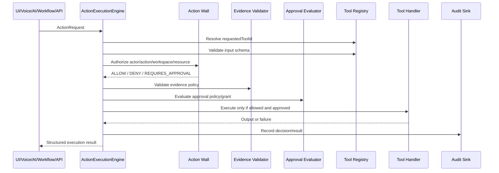

# Universal Execution Spine v1

## Purpose

The Universal Execution Spine is Flow's deterministic backend execution path for controlled actions. It is the path future UI, voice, AI agents, workflows, APIs, and background jobs must use to request privileged behavior.

It is not a CRM, invoice, workflow engine, or AI provider implementation.

## Execution Lifecycle

## Trust Boundaries

- Request source does not grant authority.
- Actor context carries user/workspace/permission scope.
- Action Wall is the deterministic authorization boundary.
- Evidence validation and approval policy are explicit gates.
- Tool handlers do not receive unrestricted database or application access.
- Audit events are emitted for executed, denied, awaiting-approval, and failed attempts.

## Action Wall

The Action Wall returns structured decisions:

- `ALLOW`
- `DENY`
- `REQUIRES_APPROVAL`

It denies cross-workspace requests and missing permissions. `AI_PERMISSION <= CURRENT_USER_PERMISSION` is enforced by actor permissions, not by caller source.

## Tool Registry

Tools declare:

- `id`
- `description`
- input and output schemas
- risk level
- required action
- evidence policy
- approval policy
- execute handler

Normal application callers should use `ActionExecutionEngine`, not direct tool handler invocation. TypeScript visibility alone is not a perfect enforcement mechanism; this is an architectural boundary that later infrastructure should harden with module ownership and runtime access controls.

## Evidence Stage

Evidence policy supports:

- `NONE`
- `OPTIONAL`
- `REQUIRED`

Missing evidence blocks evidence-required actions before tool execution. The system must not fabricate evidence.

## Approval Stage

Approval evaluation supports:

- `NO_APPROVAL_REQUIRED`
- `APPROVAL_REQUIRED`

If Action Wall or tool policy requires approval, execution stops until a scoped approval grant exists.

## Audit Stage

The audit sink records:

- actor
- workspace
- action
- tool
- decision
- result status
- timestamp
- correlation ID
- reason
- evidence references
- approval requirement/grant when present
- error status without exposing secrets

The v1 implementation uses `InMemoryAuditSink` for tests and architecture proof. Durable audit persistence is a later foundation step.

## Failure Handling

Structured execution statuses:

- `EXECUTED`
- `DENIED`
- `AWAITING_APPROVAL`
- `FAILED`

Unknown tools, invalid input, and tool failures return safe structured failures and create audit events.

## Correlation IDs

The same correlation ID flows through Actor Context, Action Request, execution result, and audit event. API middleware preserves or creates `x-correlation-id`.

## Future AI Integration

AI agents will call the Universal Execution Spine instead of receiving privileged application authority. An AI request source does not bypass Action Wall permissions.

## Future Workflow Integration

Workflow steps should create Action Requests and call the spine for side effects. Workflow state, retries, idempotency, and compensation remain workflow-layer responsibilities, while authorization, approval, evidence, tool execution, and audit flow through this spine.
